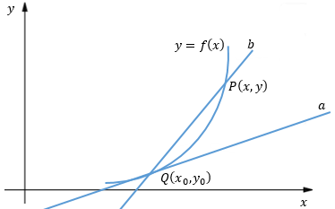
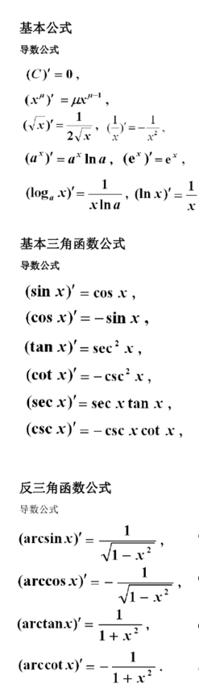
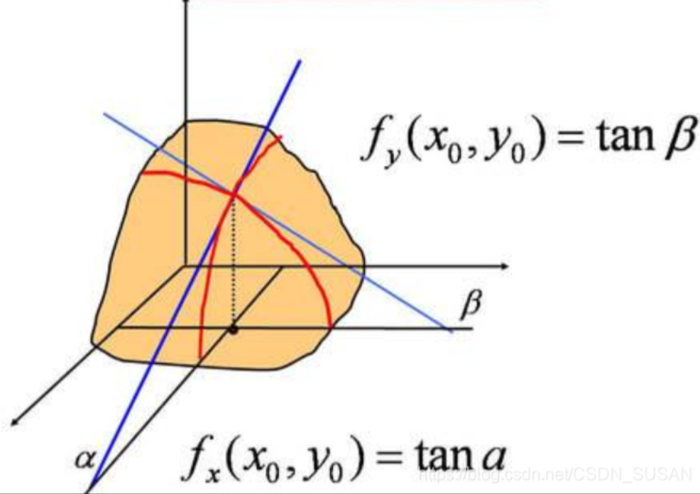

# [导数介绍]()

## [1.1 导数、偏导数、方向导数]()
  
### [1.1.1 导数]()
    
  导数是高数中的重要概念，被应用于多种学科,用于解决瞬时变化率的        
  - 从物理意义上讲，导数就是求解变化率的问题  

    我们熟知的速度公式：v = s/t，这求解的是平均速度，实际上往往需要知道瞬时速度:
    $$
     v = \cfrac{s-s_0}{t-t_0}
    $$
    当t趋近于t0，即t-t0趋近于0时，得到的就是顺时速度。设Δt=t-t0，s是t的函数s=f(t)，瞬时速度用数学表示就是：
    $$
         v = \lim_{\nabla t \to 0}\cfrac{f(t)-f(t_{0})}{\nabla t}
    $$

  - 从几何意义上讲，导数就是求函数在某一点上的切线的斜率。
](../image/dot2.png)
        直线a与曲线相切于点Q，直线b与曲线相割于点Q和点P。b的斜率是k=(y-y0)/(x-x0)，当b以Q为轴心沿着曲线旋转时，铉长|PQ|趋近于0，即x→x0时，极限存在
$$
 k = \lim_{x \to x_{0}}\cfrac{y-y_{0}}{x-x_{0}}
$$
  - 导数定义：
        设函数y=f(x)在点x0的某个邻域内有定义，当自变量x在x0处取得增量Δx，且x0+Δx仍在该邻域内时，y取得增量Δy；如果Δy与Δx之比在Δx→0时存在极限，则称函数y=f(x)在点x0处可导，并称这个极限为函数y=f(x)在点x0处的导数，记作f’(x0) ：
        $$
         f'(x) = \lim_{\nabla x \to 0}\cfrac{\nabla y}{\nabla x} = \lim_{\nabla x \to 0} \cfrac{f(x_{0} + \nabla x) - f(x_0)}{\nabla x}
        $$
        也记作：
         $$
          f' = |_{x=x_{0}}或者 \cfrac{dy}{dx}
         $$
  - 常用函数导数运算
](../image/dot3.png)

### [1.1.2 偏导数]()

  对于多元函数，求导数其实也是要求一个切线的斜率，但是由于曲面上的点的切线有无数条，那么取那条切线的斜率呢，这时候就引入了偏导数的概念。
  偏导数其实就是选取比较特殊的切线，求其斜率而得，以二元函数z=f(x,y)为例，分为对x的偏导数和对y的偏导数。
    如图所示：
    
  ](../image/dot4.png)
  对x的偏导数：过点(x0 ,y0 ,z0)垂直于y yy轴的曲线，在该点切线的斜率。
此时，该曲线可表示为
   z = f(x,y) 
   x = t 
   y = a + 0×t
因此，我们求对x 的偏导数，认为y是常量是完全正确的。
用导数定义来表示x的偏导数，
  $$
   f_{x}(x_{0},y_{0}) = \lim_{\nabla x \to 0} \cfrac{f(x_{0} + \nabla x, y_{0})-f(x_{0}，y_{0})}{\nabla x}
  $$
​
对y的偏导数：过点(x0 ,y0 ,z0)垂直于x轴的曲线，在该点切线的斜率。
用导数定义来表示x的偏导数，
  $$
   f_{y}(x_{0},y_{0}) = \lim_{\nabla y \to 0} \cfrac{f(x_{0} , y_{0}+ \nabla y)-f(x_{0}，y_{0})}{\nabla y}
  $$
同上理解。
    偏导数几何意义也是切线斜率， 但是由于曲面上一点的切线有无数条(实际上是个切面)，偏导数选取的是垂直于各坐标轴的几条特殊切线的斜率。
    偏导数物理意义表示函数沿着某个坐标轴方向上的变化率。
  
### [1.1.3 方向导数]()
  以z = f(x,y)为例，过曲面上任意一点(x0,y0,z0)的所有切线，组成一个切面。偏导数仅仅选择了垂直于x和y轴方向的两条切线，计算斜率，方向导数则要求任意切向的斜率。
##### [方向导数定义]()
  x和y平面上的一个方向向量，决定了一条过点(x0 ,y0 ,z0)的唯一曲线，此时曲线函数可表示为：
  $$
    \begin{align}
      z&=f(x,y) \\
      x&=x0+tcos\alpha, t ≥ 0 \\ 
      y&=y0+tcos\beta, t ≥ 0 \\
      u&=\vec i * cos\alpha + \vec j* cos\beta = \vec i * cos\alpha + \vec j * sin\alpha
    \end{align}
  $$
其中α和β分别为该方向向量与x轴和y轴的夹角。
则该曲线的记为方向u的导数，定义：
  $D_{u}f(x,y) = \lim_{t \to 0} \cfrac{f(x_{0}+t*cos\alpha,y_{0}+t*sin\alpha)-f(x_{0},y_{0})}{t}$
  通过偏微分简化计算可得：
  $D_{u}f(x,y) = f_{x}(x,y)cos\alpha + f_{y}(x,y)sin\alpha$
##### [方向导数的最大值]()
  $ 
  设置偏导向量：   \vec A = (f_x(x,y),f_{y}(x,y)) \\
  方向向量：  \vec u = (cos\alpha,sin\alpha) \\
  则:  D_{u}f(x,y) = \vec A * \vec u = |\vec A| * |\vec u| * cos(\theta) 
  $
  $\color{Green}其中\theta是偏导向量和方向向量之间的夹角。显而易见，当\theta=0时，D_{u}f(x,y)取最大值。换句话说，当方向u和偏导向量同向时，方向导数取得正最大值;反向时，取得负最大值。\color{Orange}记住这个结论，接下来我们看梯度定义。$
## [1.2 梯度]()
### [1.2.1 梯度概念]()
  $
  对于函数z=f(x,y)，在平面区域D内具有一阶连续偏导数，则对于每一点(x_{0}, y_{0})∈D,都可以定义出一个向量：f_{x}(x_{0},y_{0})*\vec i + f_{y}(x_{0},y_{0})*\vec j,该向量称为函数f(x,y)在(x_{0},y_{0})的梯度，记作grad f(x_{0},y_{0})或者 \bigtriangledown f(x_{0},y_{0}),其中 \bigtriangledown = \frac{\partial}{\partial x}*\vec i + \frac{\partial}{\partial y}*\vec j​称为向量微分算子或者Nabla算子
  $。

### [1.2.2 梯度上升/下降]()
  发现梯度就定义为偏导向量的方向。而方向导数一节已经证明，沿着偏导向量方向的方向导数 $D_{u}f(x,y)$能够取得最大值。因此在不断的迭代计算中，每一次沿着负梯度方向进行更新参数，就能够达到最低点

---
参考书：
《高等数学》、《简明微积分》

参考链接：
梯度
https://zh.wikipedia.org/zh-cn/%E5%81%8F%E5%AF%BC%E6%95%B0
方向导数和梯度
http://blog.csdn.net/wolenski/article/details/8030654