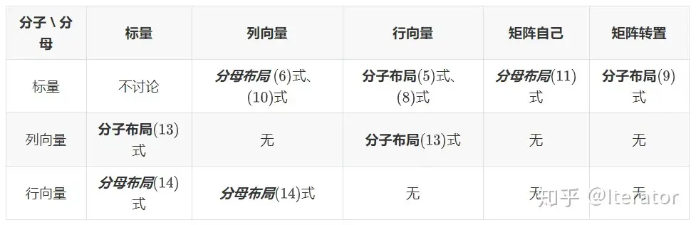

# [矩阵求导]()
## [矩阵求导——本质篇]()
### [矩阵求导的本质与分子布局、分母布局的本质]()
#### [一、函数与标量、向量、矩阵]()
考虑一个函数
$$
  function(input)
$$
针对 function 的类型、 input 的类型，我们可以将这个函数 function 分为不同的种类。
- function 是一个标量
    我们称function是一个实值标量函数。采用细体小写字母f表示。
    * input 是一个标量
    我们称function变元是标量。采用细体小写字母x表示。例如：$ f(x) = x+2 $
    * input 是一个向量
    我们称function变元是向量。采用粗体小写字母$\bf{x}$表示。例如：$ 设x=[x_{1},x_{2},x_{3}]^{T}， f(x) = a_{1}x_{1}^{2}+a_{2}x_{2}^{2}+a_{3}x_{3}^{2}+a_{4}x_{1}x_{2} $
    * input 是一个矩阵
    我们称function变元是向量。采用粗体大写字母$\bf{X}$表示。例如：$ 设\bf{X}_{3x2} = (x_{ij})_{i=1,j=1}^{3,2}, f(\bf{X}) = a_{1}x_{11}^{2} + a_{2}x_{12}^{2}+a_{3}x_{21}^{2}+a_{4}x_{22}^{2}+a_{5}x_{31}^{2}+a_{6}x_{32}^{2}$
- function 是一个向量
我们称function是一个实向量函数 。用粗体小写字母f表示。
含义： $\bf{f}$是由若干个f组成的一个向量。
同样地，变元分三种：标量、向量、矩阵。这里的符号仍与上面相同。
    * 标量变元
     $ \bf{f}_{3x1}$(x)$ = \begin{bmatrix} f_{1}(x) \\ f_{2}(x) \\ f_{3}(x) \\ \end{bmatrix} $ =  $ \begin{bmatrix}  x+1 \\ 2x+1 \\  3x^{2}+1 \\ \end{bmatrix} $
    * 向量变元
     $设\bf{x} = [x_{1},x_{2},x_{3}]^{T}$,
     $\bf{f}_{3x2}(\bf{x}) =\begin{bmatrix} f_{1}(x) \\ f_{2}(x) \\ f_{3}(x) \\ \end{bmatrix}  $ =$ \begin{bmatrix} x_{1} + x_{2}+ x_{3} \\ x_{1}^{2} + 2x_{2}+ 4x_{3} \\ x_{1}x_{2} + x_{2} + x_{3} \\ \end{bmatrix}$
    * 矩阵变元
     $\bf{X}_{3x2} = (x_{ij})_{i=1,j=1}^{3,2}$
     $\bf{f}_{3x2}(\bf{X}) = \begin{bmatrix} f_{1}(\bf{X}) \\ f_{2}(\bf{X}) \\ f_{3}(\bf{X}) \\ \end{bmatrix} $ = $\begin{bmatrix}x_{11}+x_{12}+x_{21}+x_{22}+x_{31}+x_{32} \\ x_{11}+x_{12}+x_{21}+x_{22}+x_{31}+x_{32}+x_{11}x_{12} \\ x_{11}+x_{12}+x_{21}+x_{22}+x_{31}+3x_{32} + x_{11}x_{12} \\ \end{bmatrix} $
- function 是一个矩阵
我们称function是一个实矩阵函数。用粗体大写字母$\bf{F}$表示。
含义： $\bf{F}$是由若干个f组成的一个矩阵
同样地，变元分三种：标量、向量、矩阵。这里的符号仍与上面相同。
    * 标量变元
    $\bf{F}_{3x2}$(x)$ = \begin{bmatrix} f_{11}(x) & f_{12}(x) \\  f_{21}(x) & f_{22}(x) \\  f_{31}(x) & f_{32}(x) \\ \end{bmatrix} = \begin{bmatrix} x+1 & 2x+2 \\  x^{2}+1 & 2x^{2} +1 \\  x^{3} +1 & 3x^{3} +1 \\ \end{bmatrix} $
    * 向量变元
    $设\bf{x} = [x_{1},x_{2},x_{3}]^{T}$,
    $\bf{F}_{3x2}(\bf{x}) = \begin{bmatrix}  f_{11}(\bf{x}) & f_{12}(\bf{x}) \\  f_{21}(\bf{x}) & f_{22}(\bf{x}) \\  f_{31}(\bf{x}) & f_{32}(\bf{x}) \\  \end{bmatrix} = \begin{bmatrix} 2x_{1}+x_{2}+x_{3} & 2x_{1}+2x_{2}+x_{3} \\ 2x_{1}+2x_{2}+x_{3} & x_{1}+2x_{2}+x_{3} \\ 2x_{1}+2x_{2}+2x_{3} & x_{1}+2x_{2}+3x_{3} \\ \end{bmatrix}$
    * 矩阵变元
    $设\bf{X}_{3x2} = (x_{ij})_{i=1,j=1}^{3,2}$
    $\bf{F}_{3x2}(\bf{X}) = \begin{bmatrix} f_{11}(\bf{X}) & f_{12}(\bf{X}) \\ f_{21}(\bf{X}) &  f_{21}(\bf{X}) \\ f_{31}(\bf{X}) &f_{32}(\bf{X}) \\ \end{bmatrix} $ = $\begin{bmatrix}x_{11}+x_{12}+x_{21}+x_{22}+x_{31}+x_{32} & x_{11}+x_{12}+x_{21}+x_{22}+x_{31}+2x_{32} \\ 3x_{11}+x_{12}+x_{21}+x_{22}+x_{31}+x_{32} & 4x_{11}+x_{12}+x_{21}+x_{22}+x_{31}+x_{32} \\ x_{11}+x_{12}+6x_{21}+x_{22}+x_{31}+3x_{32} & x_{11}+x_{12}+6x_{21}+3x_{22}+x_{31}+3x_{32}  \\ \end{bmatrix} $
- 总结

|function\input|标量变元|向量变元|矩阵变元|
|-------|---------|------------|-----------|
|实值标量函数|$f(x)$|$f(\bf{x})$|$f(\bf{X})$|
|实向量函数|$\bf{f}$$(x)$|$\bf{f(x)}$|$\bf{f(X)}$|
|实矩阵函数|$\bf{F}$$(x)$|$\bf{F(x)}$|$\bf{F(X)}$|

#### [二. 矩阵求导的本质]()

高等数学中介绍过，对于一个多元函数：
$$f(x_{1},x_{2},x_{3}) = x_{1}^{2} + x_{1}x_{2} + x_{2}x_{3}$$
分别对$x_{1},x_{2},x_{3}$求偏导,即：
$$
\left\{ 
    \begin{array}{l}
       \cfrac{\partial f}{\partial x_{1}} = 2x_{1} + x_{2} \\
       \cfrac{\partial f}{\partial x_{2}} = x_{1} + x_{3}\\
       \cfrac{\partial f}{\partial x_{3}} = x_{2}
    \end{array}
\right. 
$$
矩阵求导也是一样的，本质就是function中的每个f分别对变元中的每个元素逐个求偏导，只不过写成了向量、矩阵形式而已。
以列向量形式展开如下：
$$
\cfrac{\partial f(\bf{x})}{\partial \bf{x}_{3x1}} = 
    \begin{bmatrix}
       \cfrac{\partial f}{\partial x_{1}} \\
       \cfrac{\partial f}{\partial x_{2}} \\
       \cfrac{\partial f}{\partial x_{3}} 
    \end{bmatrix}
    =
    \begin{bmatrix}
         2x_{1} + x_{2} \\
         x_{1} + x_{3}\\
         x_{2}
    \end{bmatrix}
    (1)
$$
以行向量形式展开如下：
$$
\cfrac{\partial f(\bf{x})}{\partial \bf{x}_{3x1}} = 
    \begin{bmatrix}
       \cfrac{\partial f}{\partial x_{1}}, &
       \cfrac{\partial f}{\partial x_{2}}, &
       \cfrac{\partial f}{\partial x_{3}} 
    \end{bmatrix}
    =
    \begin{bmatrix}
         2x_{1} + x_{2}, &
         x_{1} + x_{3},&
         x_{2}
    \end{bmatrix}
    (2)
$$
$\color{Orange}{如果function中有m个f，变元中有n个元素，那么，每个f对变元中的每个元素逐个求偏导后，我们就会产生mxn个结果。这就是矩阵求导的本质}$
#### [三. 矩阵求导结果的布局]()
$分子布局，就是分子是列向量形式，分母是行向量形式, 如(2)式。如果这里的function是实向量函数f_{2x1}的话，结果就是2x3的矩阵了:$
$$
   \cfrac{\partial f_{2*1}(\bf{x})}{\partial \bf{x^{T}}_{3*1}} =  
   \begin{bmatrix}
       \cfrac{\partial f_{1}}{\partial x_{1}}, &
       \cfrac{\partial f_{1}}{\partial x_{2}}, &
       \cfrac{\partial f_{1}}{\partial x_{3}} \\
       \cfrac{\partial f_{2}}{\partial x_{1}}, &
       \cfrac{\partial f_{2}}{\partial x_{2}}, &
       \cfrac{\partial f_{2}}{\partial x_{3}}
   \end{bmatrix}_{2*3}
$$
$分母布局，就是分母是列向量形式，分子是行向量形式，如(1)式。如果这里的function是实向量函数f_{2x1}的话，结果就是3x2的矩阵了:$
$$
\cfrac{\partial f_{2*1}^{T}(\bf{x})}{\partial \bf{x}_{3*1}} =
\begin{bmatrix}
       \cfrac{\partial f_{1}}{\partial x_{1}}, &
       \cfrac{\partial f_{2}}{\partial x_{1}},\\
       \cfrac{\partial f_{1}}{\partial x_{2}}, &
       \cfrac{\partial f_{2}}{\partial x_{2}}, \\
       \cfrac{\partial f_{1}}{\partial x_{3}} &
       \cfrac{\partial f_{2}}{\partial x_{3}}
   \end{bmatrix}_{3*2}
$$
#### [四. 分子布局、分母布局的本质]()
1、分子布局的本质：分子是标量、列向量、矩阵向量化后的列向量；分母是标量、列向量转置后的行向量、矩阵的转置矩阵、矩阵向量化后的列向量转置后的行向量。

2、分母布局的本质：分子是标量、列向量转置后的行向量、矩阵向量化后的列向量转置后的行向量；分母是标量、列向量、矩阵自己、矩阵向量化后的列向量。
](../image/matrix1.png)

## [矩阵求导公式的数学推导]()
#### [向量变元的实值标量函数]()
$$
f(\bf{x}),\bf{x} = [x_{1},x_{2},x_{3}...,x_{n}]^{T}
$$
使用梯度向量形式,即：
$ \nabla_{x} f(\bf{x}) = \cfrac{\partial f(\bf{x})}{\partial\bf{x}} = \begin{bmatrix} \cfrac{\partial f}{\partial x_{1}},\cfrac{\partial f}{\partial x_{2}},...,\cfrac{\partial f}{\partial x_{n}} \end{bmatrix} $

- 四个法则
    * 常数求导法则：与一元函数常数求导相同：结果为零向量。
     $$\frac{\partial c}{\partial \bf{x}} = \begin{bmatrix} \cfrac{\partial f}{\partial x_{1}}\\ \cfrac{\partial f}{\partial x_{2}}\\ ...\\ \cfrac{\partial f}{\partial x_{n}} \end{bmatrix}=\begin{bmatrix} 0\\ 0\\ ...\\ 0 \end{bmatrix} = 0_{n * 1}$$

        其中，c为常数。

    * 线性法则：与一元函数求导线性法则相同：相加再求导等于求导再相加，常数提外面
        $$\frac{\partial[c_{1}f(\bf{x})+c_{2}g(\bf{x})]}{\partial \bf{x}} $$
        其中，$c_{1},c_{2}$为常数。
        $$\frac{\partial[c_{1}f(\bf{x})+c_{2}g(\bf{x})]}{\partial \bf{x}} =$$
        $$ = \begin{bmatrix} 
        \frac{\partial (c_{1}f+c_{2}g)}{\partial x_{1}} \\
        \frac{\partial (c_{1}f+c_{2}g)}{\partial x_{1}} \\
        ... \\
        \frac{\partial (c_{1}f+c_{2}g)}{\partial x_{n}} 
        \end{bmatrix} 
        $$

        $$ = \begin{bmatrix} 
        \frac{\partial (c_{1}f)}{\partial x_{1}} +\frac{\partial(c_{2}g)}{\partial x_{1}} \\
        \frac{\partial (c_{1}f)}{\partial x_{1}} +\frac{\partial(c_{2}g)}{\partial x_{1}} \\
        ... \\
        \frac{\partial(c_{2}g)}{\partial x_{n}} + \frac{\partial(c_{2}g)}{\partial x_{n}} 
        \end{bmatrix} 
        $$
        $$ = \begin{bmatrix} 
        c_{1}\frac{\partial f}{\partial x_{1}} \\
        c_{1}\frac{\partial f}{\partial x_{1}} \\
        ... \\
        c_{1}\frac{\partial f}{\partial x_{n}}  
        \end{bmatrix} 
        +     
        \begin{bmatrix} 
        c_{2}\frac{\partial g}{\partial x_{1}} \\
        c_{2}\frac{\partial g}{\partial x_{1}} \\
        ... \\
        c_{2}\frac{\partial g}{\partial x_{n}} 
        \end{bmatrix} 
        $$
        $$ = c_{1} \begin{bmatrix} 
        \frac{\partial f}{\partial x_{1}} \\
        \frac{\partial f}{\partial x_{1}} \\
        ... \\
        \frac{\partial f}{\partial x_{n}}  
        \end{bmatrix} +     
        c_{2} \begin{bmatrix} 
        \frac{\partial g}{\partial x_{1}} \\
        \frac{\partial g}{\partial x_{1}} \\
        ... \\
        \frac{\partial g}{\partial x_{n}} 
        \end{bmatrix} 
        $$
        $$ = c_{1}\frac{\partial f(\bf{x})}{\partial \bf{x}} + c_{2}\frac{\partial g(\bf{x})}{\partial \bf{x}}        $$

 
    * 乘积法则：与一元函数求导乘积法则相同：前导后不导 加 前不导后导
    $$\frac{\partial [f(\bf{x})g(\bf(x))]}{\partial (\bf(x))}$$
    $$ = \begin{bmatrix} 
        \frac{\partial (f*g)}{\partial \bf{x_{1}}} \\ 
        \frac{\partial (f*g)}{\partial \bf{x_{2}}} \\ 
        \frac{\partial (f*g)}{\partial \bf{x_{3}}} \\ 
        .\\ 
        .\\
        .\\
        \frac{\partial (f*g)}{\partial \bf{x_{n}}} 
        \end{bmatrix}
    $$
    $$ = \begin{bmatrix} 
       \frac{\partial f}{\partial \bf{x_{1}}}*g +\frac{\partial g}{\partial \bf{x_{1}}}*f \\ 
       \frac{\partial f}{\partial \bf{x_{2}}}*g +\frac{\partial g}{\partial \bf{x_{2}}}*f \\ 
       \frac{\partial f}{\partial \bf{x_{3}}}*g +\frac{\partial g}{\partial \bf{x_{3}}}*f \\ 
        .\\
        .\\
        .\\ 
       \frac{\partial f}{\partial \bf{x_{n}}}*g +\frac{\partial g}{\partial \bf{x_{n}}}*f  
        \end{bmatrix}
    $$
    $$ = \begin{bmatrix} 
       \frac{\partial f}{\partial \bf{x_{1}}}*g  \\ 
       \frac{\partial f}{\partial \bf{x_{2}}}*g  \\ 
       \frac{\partial f}{\partial \bf{x_{3}}}*g  \\ 
        .\\
        .\\
        .\\ 
       \frac{\partial f}{\partial \bf{x_{n}}}*g   
        \end{bmatrix}
        +
       \begin{bmatrix} 
       \frac{\partial g}{\partial \bf{x_{1}}}*f \\ 
       \frac{\partial g}{\partial \bf{x_{2}}}*f \\ 
       \frac{\partial g}{\partial \bf{x_{3}}}*f \\ 
        .\\
        .\\
        .\\ 
       \frac{\partial g}{\partial \bf{x_{n}}}*f 
       \end{bmatrix}
    $$
    $$ = \begin{bmatrix} 
       \frac{\partial f}{\partial \bf{x_{1}}}  \\ 
       \frac{\partial f}{\partial \bf{x_{2}}}  \\ 
       \frac{\partial f}{\partial \bf{x_{3}}}  \\ 
        .\\
        .\\
        .\\ 
       \frac{\partial f}{\partial \bf{x_{n}}}  
        \end{bmatrix}*g
        +
       \begin{bmatrix} 
       \frac{\partial g}{\partial \bf{x_{1}}} \\ 
       \frac{\partial g}{\partial \bf{x_{2}}} \\ 
       \frac{\partial g}{\partial \bf{x_{3}}} \\ 
        .\\
        .\\
        .\\  
       \frac{\partial g}{\partial \bf{x_{n}}}  
       \end{bmatrix}*f
    $$
    $$ = \frac{\partial f(\bf{x})}{\partial {\bf{x}}}*g(\bf{x}) + \frac{\partial g(\bf{x})}{\partial {\bf{x}}}*f(\bf{x})$$

    * 商法则：与一元函数求导商法则相同：（上导下不导 减 上不导下导）除以（下的平方）
    $$ \frac{\partial[\frac{f(\bf{x})}{g(\bf{x})}]}{\partial \bf{x}} = \frac{1}{g^{2}(\bf{x})}[\frac{\partial f(\bf{x})}{\partial \bf{x}}*g(\bf{x}) - f(\bf{x})*\frac{\partial g(\bf{x})}{\partial \bf{x}}]$$
    
    转换成乘法法则推导即可证明。

- 几个公式
    * 2.1 
        $$\frac{\partial (\bf{x}^{T}\bf{a})}{\partial \bf{x}} = \frac{\bf{a}^{T}\bf{x}}{\partial \bf{x}} = \bf{a}$$
            其中 $\bf{a} 为常数向量，\bf{a} = (a_{1},a_{2},a_{3},...,a_{n})^{T}。$

        $$\frac{\partial (\bf{x}^{T}\bf{a})}{\partial \bf{x}} = \frac{\bf{a}^{T}\bf{x}}{\partial \bf{x}}$$
        $$   = \frac{\partial (a_{1}x_{1},a_{2}x_{2},a_{3}x_{3},...,a_{n}x_{n})}{\partial \bf{x}}$$
        $$   = \begin{bmatrix} 
                        \large\frac{\partial (a_{1}x_{1},a_{2}x_{2},a_{3}x_{3},...,a_{n}x_{n})}{\partial {x_{1}}}\large \\
                        \large\frac{\partial (a_{1}x_{1},a_{2}x_{2},a_{3}x_{3},...,a_{n}x_{n})}{\partial {x_{2}}}\large \\
                        ... \\
                        \large\frac{\partial (a_{1}x_{1},a_{2}x_{2},a_{3}x_{3},...,a_{n}x_{n})}{\partial {x_{n}}}\large
                        \end{bmatrix} $$
        $$   = \begin{bmatrix} 
                a_{1} \\
                a_{2} \\
                .\\
                .\\
                .\\ 
                a_{n}  
              \end{bmatrix}$$
        $$   = \bf{a}$$

    * 2.2 
        $$\frac{\partial(\bf{x}^{T}\bf{x})}{\partial \bf{x}} = \frac{\partial (x_{1}^{2}+x_{2}^{2}+...+x_{n}^{2})}{\bf{x}}$$
        $$ = \begin{bmatrix} 
                \frac{\partial (x_{1}^{2}+x_{2}^{2}+...+x_{n}^{2})}{x_{1}} \\
                \frac{\partial (x_{1}^{2}+x_{2}^{2}+...+x_{n}^{2})}{x_{2}} \\
                .\\
                .\\
                .\\ 
                \frac{\partial (x_{1}^{2}+x_{2}^{2}+...+x_{n}^{2})}{x_{n}}
            \end{bmatrix}$$
        $$ = \begin{bmatrix} 
                2{x_{1}} \\
                2{x_{2}} \\
                .\\
                .\\
                .\\ 
                2{x_{n}}
            \end{bmatrix}$$
        $$ = 2*\begin{bmatrix} 
                {x_{1}} \\
                {x_{2}} \\
                .\\
                .\\
                .\\ 
                {x_{n}}
            \end{bmatrix}$$
        $$ = 2\bf{x}$$

    * 2.3 
    $$
    \frac{\partial(\bf{x}^{T}\bf{A}\bf{x})}{\partial \bf{x}} = \bf{A}\bf{x}+\bf{A}^{T}\bf{x}
    $$
    $其中，A_{nxn}是常数矩阵，A_{nxn} = (ij)_{i=1,j=1}^{n,n}。$
    
    $$ 
    \frac{\partial(\bf{x}^{T}\bf{A}\bf{x})}{\partial \bf{x}} = \frac{\partial ((x_{1}a_{11}+x_{2}a_{21}+...+x_{n}a_{n1}),(x_{1}a_{12}+x_{2}a_{22}+...+x_{n}a_{n2}),...,(x_{1}a_{1n}+x_{2}a_{2n}+...+x_{n}a_{nn}))*(x_{1},x_{2},...,x_{n}))}{\partial \bf{x}} $$
    $$ = \frac{\partial ((x_{1}a_{11}+x_{2}a_{21}+...+x_{n}a_{n1})*x_{1},(x_{1}a_{12}+x_{2}a_{22}+...+x_{n}a_{n2})*x_{2},...,(x_{1}a_{1n}+x_{2}a_{2n}+...+x_{n}a_{nn})*x_{n}))}{\partial \bf{x}} $$
    $$ = \frac{\partial (x_{1}a_{11}x_{1}+x_{1}a_{12}x_{2}+...+x_{n}a_{n1}x_{1}+...+x_{2}a_{21}x_{1}+x_{2}a_{22}x_{1}+...+x_{2}a_{2n}x_{n}+...+x_{n}a_{n1}x_{1}+x_{n}a_{n2}x_{2}+...+x_{n}a_{nn}x_{n})}{\partial \bf{x}} $$
    $$ = \begin{bmatrix} 
         \frac{\partial (x_{1}a_{11}x_{1}+x_{1}a_{12}x_{2}+...+x_{n}a_{n1}x_{1}+...+x_{2}a_{21}x_{1}+x_{2}a_{22}x_{1}+...+x_{2}a_{2n}x_{n}+...+x_{n}a_{n1}x_{1}+x_{n}a_{n2}x_{2}+...+x_{n}a_{nn}x_{n})}{\partial x_{1}}\\
         \frac{\partial (x_{1}a_{11}x_{1}+x_{1}a_{12}x_{2}+...+x_{n}a_{n1}x_{1}+...+x_{2}a_{21}x_{1}+x_{2}a_{22}x_{1}+...+x_{2}a_{2n}x_{n}+...+x_{n}a_{n1}x_{1}+x_{n}a_{n2}x_{2}+...+x_{n}a_{nn}x_{n})}{\partial x_{2}}\\
        .\\
        .\\
        .\\
         \frac{\partial (x_{1}a_{11}x_{1}+x_{1}a_{12}x_{2}+...+x_{n}a_{n1}x_{1}+...+x_{2}a_{21}x_{1}+x_{2}a_{22}x_{1}+...+x_{2}a_{2n}x_{n}+...+x_{n}a_{n1}x_{1}+x_{n}a_{n2}x_{2}+...+x_{n}a_{nn}x_{n})}{\partial x_{n}}\\
    \end{bmatrix} $$
    $$ = \begin{bmatrix} 
        2x_{1}a_{11}+ x_{2}a_{21}+...+x_{n}a_{n1} + a_{12}x_{2}+ a_{13}x_{3}+...+ a_{1n}x_{n}\\
         x_{1}a_{12}+2x_{2}a_{22}+...+x_{n}a_{n2} + a_{12}x_{1}+ a_{23}x_{3}+...+ a_{2n}x_{n}\\
        .\\
        .\\
        .\\
         x_{1}a_{1n}+x_{2}a_{2n}+...+2x_{n}a_{nn} + a_{n1}x_{1}+ a_{n2}x_{2}+...+ a_{n(n-1)}x_{n-1}\\
    \end{bmatrix} $$
    $$ = \begin{bmatrix} 
        (a_{11}x_{1}+a_{21}x_{2}+...+a_{n1}x_{n}) + (a_{11}x_{1}+ a_{12}x_{2}+ a_{13}x_{3}+...+ a_{1n}x_{n})\\
        (a_{12}x_{1}+a_{22}x_{2}+...+a_{n2}x_{n}) + (a_{21}x_{2}+ a_{22}x_{2}+ a_{23}x_{3}+...+ a_{2n}x_{n})\\
        .\\
        .\\
        .\\
         (a_{1n}x_{1}+a_{2n}x_{2}+...+a_{nn}x_{n})+ (a_{21}x_{n}+a_{23}x_{n}+...+a_{n(n-1)}x_{n}+a_{nn}x_{n})\\
         \end{bmatrix} $$
    $$ = \begin{bmatrix} 
             a_{11}x_{1}+a_{21}x_{2}+...+a_{n1}x_{n} \\
             a_{12}x_{1}+a_{22}x_{2}+...+a_{n2}x_{n} \\
             .\\
             .\\
             a_{1n}x_{1}+a_{2n}x_{2}+...+a_{nn}x_{n}
         \end{bmatrix} 
         + 
         \begin{bmatrix}
            a_{11}x_{1}+ a_{12}x_{2}+ a_{13}x_{3}+...+ a_{1n}x_{n} \\
            a_{21}x_{2}+ a_{22}x_{2}+ a_{23}x_{3}+...+ a_{2n}x_{n} \\
            .\\
            .\\
            a_{n1}x_{1}+ a_{n2}x_{2}+ a_{n3}x_{3}+...+a_{nn}x_{n}
         \end{bmatrix}$$
    $$ = \begin{bmatrix} 
             a_{11},a_{21},...,a_{n1} \\
             a_{12},a_{22},...,a_{n2} \\
             .\quad   \quad.   \quad.   \quad.\\
             .\quad   \quad.   \quad.   \quad.\\
             .\quad   \quad.   \quad.   \quad.\\
             a_{1n},a_{2n},...,a_{nn}
         \end{bmatrix} *
         \begin{bmatrix}
          x_{1}\\
          x_{2}\\
          .\\
          .\\
          .\\
          x_{n}\\
         \end{bmatrix}
         + 
         \begin{bmatrix}
            a_{11}x_{1}, a_{12}x_{2}, a_{13}x_{3},..., a_{1n}x_{n} \\
            a_{21}x_{2}, a_{22}x_{2}, a_{23}x_{3},..., a_{2n}x_{n} \\
             .\qquad   \qquad.   \qquad\qquad.   \qquad\qquad.\\
             .\qquad   \qquad.   \qquad\qquad.   \qquad\qquad.\\
             .\qquad   \qquad.   \qquad\qquad.   \qquad\qquad.\\
            a_{n1}x_{1}, a_{n2}x_{2}, a_{n3}x_{3},...,a_{nn}x_{n}
         \end{bmatrix}*
         \begin{bmatrix}
          x_{1}\\
          x_{2}\\
          .\\
          .\\
          .\\
          x_{n}\\
         \end{bmatrix}
         $$
    $$ =   \bf{A}\bf{x}  + \bf{A}^{T}\bf{x}$$
    * 2.4
      $$
       \frac{\partial \bf{a}^{T}\bf{x}\bf{x}^{T}\bf{b}}{\partial \bf{x}} = \bf{a}\bf{b}^{T}\bf{x} + \bf{b}\bf{a}^{T}\bf{x}
      $$
    $其中，\bf{a},\bf{b}为常数向量，a=(a_{1},a_{2},...,a_{n})^{T},b=(b_{1},b_{2},...,b_{n})^{T}。 $

-----
参考：
    https://zhuanlan.zhihu.com/p/263777564
    https://zhuanlan.zhihu.com/p/273729929