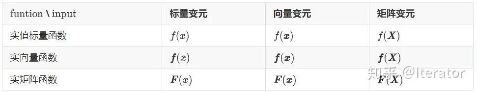

# [矩阵求导]()
## [矩阵求导——本质篇]()
### [矩阵求导的本质与分子布局、分母布局的本质]()
#### [一、函数与标量、向量、矩阵]()
考虑一个函数
$$
  function(input)
$$
针对 function 的类型、 input 的类型，我们可以将这个函数 function 分为不同的种类。
- function 是一个标量
    我们称function是一个实值标量函数。采用细体小写字母f表示。
 * input 是一个标量
    我们称function变元是标量。采用细体小写字母x表示。例如：$ f(x) = x+2 $
 * input 是一个向量
    我们称function变元是向量。采用粗体小写字母$\bf{x}$表示。例如：$ 设x=[x_{1},x_{2},x_{3}]^{T}， f(x) = a_{1}x_{1}^{2}+a_{2}x_{2}^{2}+a_{3}x_{3}^{2}+a_{4}x_{1}x_{2} $
 * input 是一个矩阵
    我们称function变元是向量。采用粗体大写字母$\bf{X}$表示。例如：$ 设\bf{X}_{3x2} = (x_{ij})_{i=1,j=1}^{3,2}, f(\bf{X}) = a_{1}x_{11}^{2} + a_{2}x_{12}^{2}+a_{3}x_{21}^{2}+a_{4}x_{22}^{2}+a_{5}x_{31}^{2}+a_{6}x_{32}^{2}$
- function 是一个向量
我们称function是一个实向量函数 。用粗体小写字母f表示。
含义： $\bf{f}$是由若干个f组成的一个向量。
同样地，变元分三种：标量、向量、矩阵。这里的符号仍与上面相同。
 * 标量变元
     $ \bf{f}_{3x1}(x) = \begin{bmatrix} f_{1}(x) \\ f_{2}(x) \\ f_{3}(x) \\ \end{bmatrix} $ =  $ \begin{bmatrix}  x+1 \\ 2x+1 \\  3x^{2}+1 \\ \end{bmatrix} $
 * 向量变元
     $设\bf{x} = [x_{1},x_{2},x_{3}]^{T}$,
     $\bf{f}_{3x2}(\bf{x}) =\begin{bmatrix} f_{1}(x) \\ f_{2}(x) \\ f_{3}(x) \\ \end{bmatrix}  $ =$ \begin{bmatrix} x_{1} + x_{2}+ x_{3} \\ x_{1}^{2} + 2x_{2}+ 4x_{3} \\ x_{1}x_{2} + x_{2} + x_{3} \\ \end{bmatrix}$
 * 矩阵变元
     $\bf{X}_{3x2} = (x_{ij})_{i=1,j=1}^{3,2}$
     $\bf{f}_{3x1}(\bf{X}) = \begin{bmatrix} f_{1}(\bf{X}) \\ f_{2}(\bf{X}) \\ f_{3}(\bf{X}) \\ \end{bmatrix} $ = $\begin{bmatrix}x_{11}+x_{12}+x_{21}+x_{22}+x_{31}+x_{32} \\ x_{11}+x_{12}+x_{21}+x_{22}+x_{31}+x_{32}+x_{11}x_{12} \\ x_{11}+x_{12}+x_{21}+x_{22}+x_{31}+3x_{32} + x_{11}x_{12} \\ \end{bmatrix} $
- function 是一个矩阵
我们称function是一个实矩阵函数。用粗体大写字母$\bf{F}$表示。
含义： $\bf{F}$是由若干个f组成的一个矩阵
同样地，变元分三种：标量、向量、矩阵。这里的符号仍与上面相同。
 * 标量变元
 * 向量变元
 * 矩阵变元

#### [二. 矩阵求导的本质]()
#### [三. 矩阵求导结果的布局]()
#### [四. 分子布局、分母布局的本质]()
## 
## 

-----
参考：https://zhuanlan.zhihu.com/p/263777564