# [支持向量机SVM]()
## [概述]()
本文介绍了SVM的理论，细致说明了“间隔”和“超平面”两个概念；随后，阐述了如何最大化间隔并区分了软硬间隔SVM；同时，介绍了SVC问题的应用。最后，用SVM乳腺癌诊断经典数据集，对SVM进行了深入的理解。

>支持向量机(support vector machines, SVM)是一种二分类模型，它的基本模型是定义在特征空间上的间隔最大的线性分类器，间隔最大使它有别于感知机。
SVM的的学习策略就是间隔最大化，可形式化为一个求解凸二次规划的问题，也等价于正则化的合页损失函数的最小化问题。$\color{Orange}SVM的学习算法就是求解凸二次规划的最优化算法。$

下图为SVM的分类效果显示，可以发现，不管是线性还是非线性，SVM均表现良好。
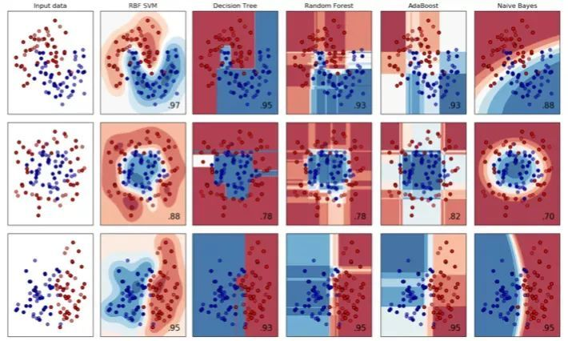](../image/svm-0.png)

## [SVM理论]()

$$支持向量机(Support Vector Machine：SVM)的目的是用训练数据集的间隔最大化找到一个最优分离超平面。$$

下边用一个例子来理解下间隔和分离超平面两个概念。现在有一些人的身高和体重数据，将它们绘制成散点图，是这样的：
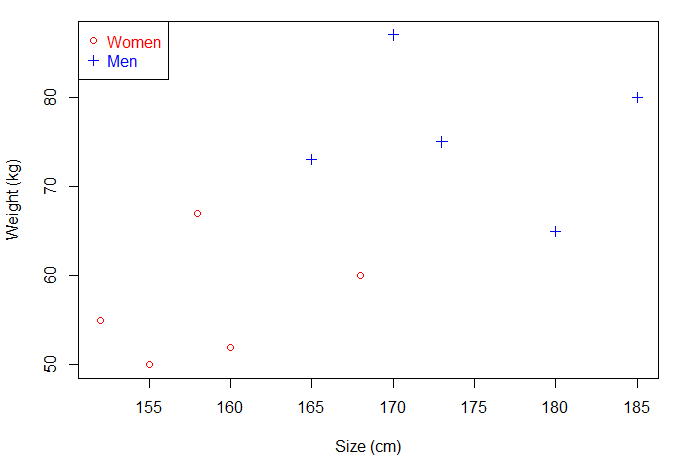](../image/svm-1.png)
如果现在给你一个未知男女的身高和体重，你能分辨出性别吗？直接将已知的点划分为两部分，这个点落在哪一部分就对应相应的性别。那就可以画一条直线，直线以上是男生，直线以下是女生。
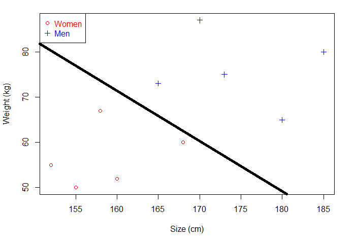](../image/svm-2.png)
问题来了，现在这个是一个二维平面，可以画直线，如果是三维的呢？该怎么画?我们知道一维平面是点，二维平面是线，三维平面是面。

对的，那么注意，今天的第一个概念：$\color{Green}超平面$是平面的一般化：

在一维的平面中，它是点
在二维的平面中，它是线
在三维的平面中，它是面
在更高的维度中，我们称之为超平面
注意：后面的直线、平面都直接叫超平面了。

继续刚才的问题，我们刚才是通过一个分离超平面分出了男和女，这个超平面唯一吗？很明显，并不唯一，这样的超平面有若干个。

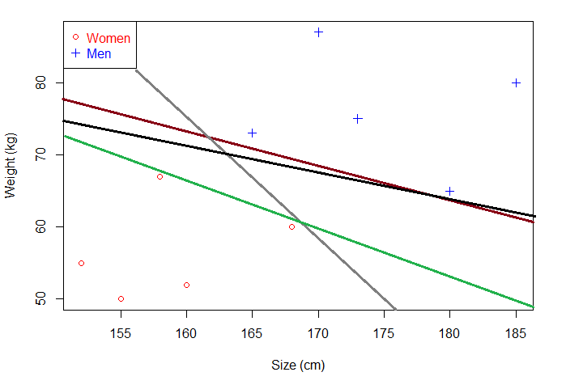](../image/svm-3.png)
那么问题来了，既然有若干个，那肯定要最好的，这里最好的叫$\color{Green}最优分离超平面$。$\color{Orange}如何在众多分离超平面中选择一个最优分离超平面？$下面这两个分离超平面，你选哪个？绿色的还是黑色的？
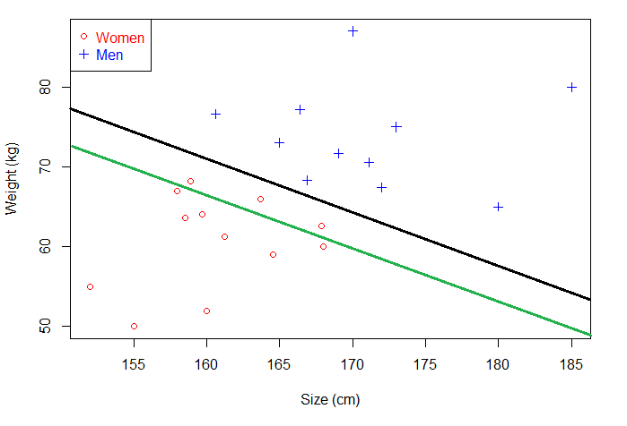](../image/svm-4.png)
对，当然是黑色的。
> 可是原理是什么？很简单，原理有两个，分别是：
- 正确的对训练数据进行分类
- 对未知数据也能很好的分类

其中当间隔达到最大，两侧样本点的距离相等的超平面为最优分离超平面。注意，今天的第二个概念：对应上图，Margin对应的就是最优分离超平面的间隔，此时的间隔达到最大。

一般来说，间隔中间是无点区域，里面不会有任何点（理想状态下）。给定一个超平面，我们可以就算出这个超平面与和它最接近的数据点之间的距离。那么间隔（Margin）就是二倍的这个距离。

如果还是不理解为什么这个分离超平面就是最优分离超平面，那你在看这张图。

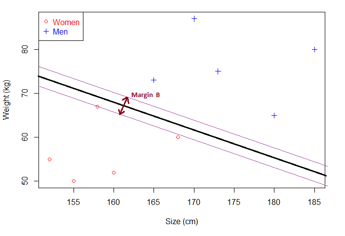](../image/svm-5.png)
在这张图里面间隔MarginB小于上张图的MarginA。当出现新的未知点，MarginB分离超平面的泛化能力不如MarginA，用MarginB的分离超平面去分类，错误率大于MarginA

>总结：
支持向量机是为了通过间隔最大化找到一个最优分离超平面。在决定分离超平面的时候，只有极限位置的那两个点有用，其他点根本没有大作用，因为只要极限位置离得超平面的距离最大，就是最优的分离超平面了。 

## [如何确定最大化间隔]()
$如果我们能够确定两个平行超平面，那么两个超平面之间的最大距离就是最大化间隔。$看个图你就都明白了：
](../image/svm-6.png)
左右两个平行超平面将数据完美的分开，我们只需要计算上述两个平行超平面的距离即可。所以，我们找到最大化间隔：
- 找到两个平行超平面，可以划分数据集并且两平面之间没有数据点
- 最大化上述两个超平面

### [1.确定两个平行超平面]()
$\color{Orange}怎么确定两个平行超平面？$
我们知道一条直线的数学方程是：y-ax+b=0，而超平面会被定义成类似的形式：$\bf{w}^{T}\bf{x}-b=0$

推广到n维空间，则超平面方程中的w、x分别为：
$$
\begin{align}
\bf{w} & = [w_{1},w_{2},...,w_{n}]^{T} \\
\bf{x} & = [x_{1},x_{2},...,x_{n}]^{T}
\end{align}
$$

$\color{Orange}如何确保两超平面之间没有数据点？$
我们的目的是通过两个平行超平面对数据进行分类，那我们可以这样定义两个超平面。

对于每一个向量xi：满足：

$$w⋅x_{i}−b \ge 1\; for \; x_{i}属于类别1$$
或者
$$w⋅x_{i}−b \le -1\; for \; x_{i}属于类别-1$$
也就是这张图：所有的红点都是1类，所有的蓝点都是−1类。
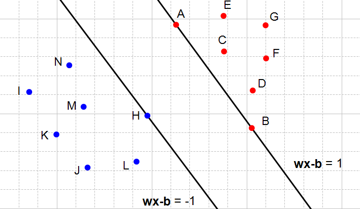](../image/svm-7.png)
整理一下上面的两个超平面,合并后可得(约束条件)：
$\color{Blue} y_{i}(\bf{w}\cdot\bf{x}_{i}-b) \ge 1 \; for \;all\; x_{i}\;, 1 \le i \le n $

### [2.确定间隔]()
$\color{Orange}如何求两个平行超平面的间隔呢？$
我们可以先做这样一个假设：

- $H_{0}$是满足约束 $w⋅x_{i}−b \le -1$ 的超平面
- $H_{1}$是满足约束 $w⋅x_{i}−b \ge 1$ 的超平面
- $x_{0}$是满足$H_{0}$的一点
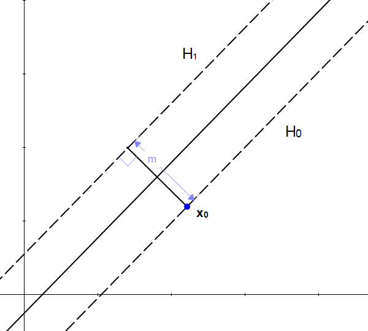](../image/svm-8.png)

这个间隔是可以通过计算出来的，推导还需要一些步骤，直接放结果了就：$m=\frac{2}{||w||}$
其中||w||表示w的二范数，求所有元素的平方和，然后在开方。比如，二维平面下：
$||w|| = \$
可以发现，w 的模越小，间隔m 越大

### [3.确定目标]()
我们的间隔最大化，最后就成了这样一个问题:

>在约束条件 $y_{i}(\bf{w}\cdot\bf{x}_{i}-b) \ge 1$  (对于i=1,...,n)的情况下, 找到使||w||最小的w,b

我们的最优分离超平面就确定了，目的也就达到了

$\color{Orange}上面的最优超平面问题是一个凸优化问题，可以转换成了拉格朗日的对偶问题，判断是否满足KKT条件，然后求解。$
上一句话包含的知识是整个SVM的核心，涉及到大量的公式推导。
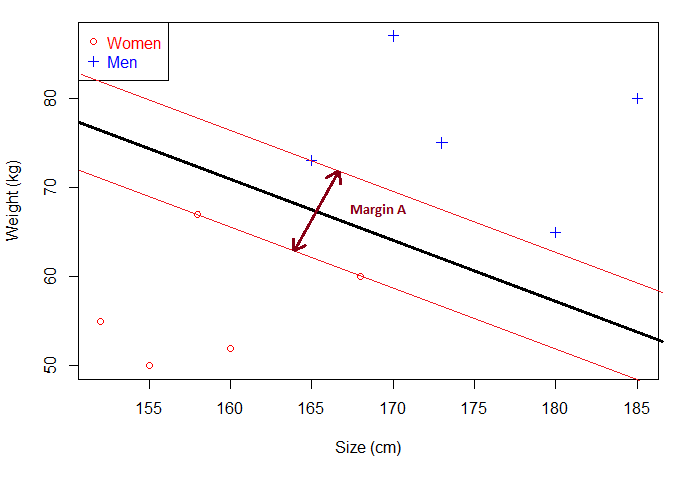](../image/svm-9.png)
除去上面我们对最大间隔的推导计算，剩下的部分其实是不难理解的。从上面过程，我们可以发现，其实最终分类超平面的确定依赖于部分极限位置的样本点，这叫做支持向量。

由于支持向量在确定分离超平面中起着决定性作用，所有将这类模型叫做支持向量机。

## [针对不同样本数据的SVM]()
我们在上面图中的点都是线性可分的，也就是一条线（或一个超平面）可以很容易的分开的。但是实际情况不都是这样，比如有的女生身高比男生高，有的男生体重比女生都轻，像这种存在噪声点分类，应该怎么处理？

1. 硬间隔线性SVM

上面例子中提到的样本点都是线性可分的，我们就可以通过分类将样本点完全分类准确，不存在分类错误的情况，这种叫硬间隔，这类模型叫做硬间隔线性SVM。

>线性可分支持向量机（linear support vector machine in linearly separable case）：训练数据线性可分的情况下，通过硬间隔最大化（hard margin maximization），学习一个线性的分类器，即线性可分支持向量机（亦称作硬间隔支持向量机）

2. 软间隔线性SVM

同样的，可以通过分类将样本点不完全分类准确，存在少部分分类错误的情况，这叫软间隔，这类模型叫做软间隔线性SVM。
> 线性支持向量机（linear support vector machine）：训练数据近似线性可分的情况下，通过软间隔最大化（soft margin maximization），学习一个线性的分类器，称作线性支持向量机（又叫软间隔支持向量机）

不一样的是，因为有分类错误的样本点，但我们仍需要将错误降至最低，所有需要添加一个惩罚项来进行浮动，所有此时求解的最大间隔就变成了这样
$$
    \underset{w,b}{min}\frac{1}{2}||w||^{2}+C\sum_{i=1}^{N}\epsilon_{i}, 服从y_{i}(w \cdot x_{i}+b) \ge 1-\epsilon_{i},i=1,2,\cdots,n
$$

$\color{Orange}硬间隔和软间隔都是对线性可分的样本点进行分类，那如果样本点本身就不线性可分？$

3. 非线性支持向量机

> 非线性支持向量机（non-linear support vector machine）：训练数据线性不可分的情况下，通过使用核技巧（kernel trick）及软间隔最大化，学习非线性分类器，称作非线性支持向量机。

通过使用核函数可以学习非线性支持向量机，等价于隐式地在高维的特征空间中学习线性支持向量机。这样的方法称为核技巧

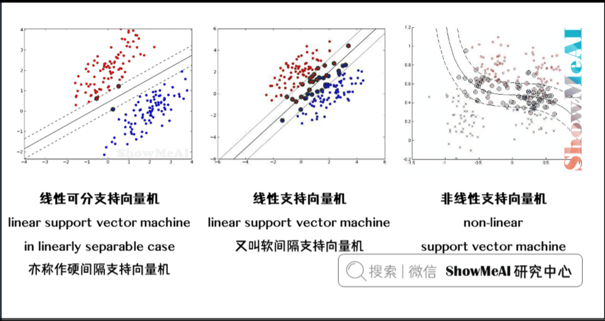](../image/svm-11.png)

>$\color{Orange}样本点并不是线性可分的，这种问题应该怎么处理呢?$
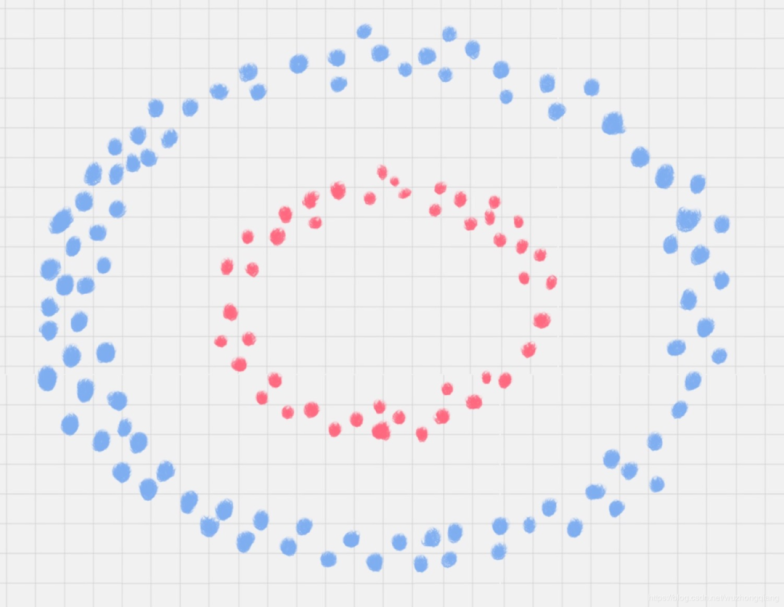](../image/svm-10.png)

所以我们需要一种方法:
        $\bf{将样本从原始空间映射到一个更高维度的空间中，使得样本在新的空间中线性可分}$
        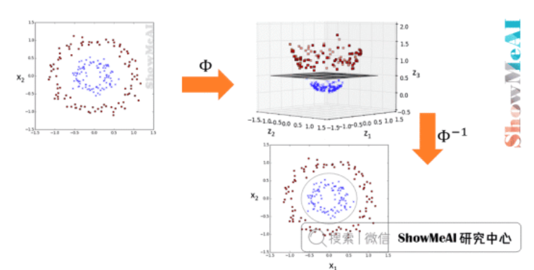](../image/svm-12.png)
         支持向量机可以借助核技巧完成复杂场景下的非线性分类，当输入空间为欧式空间或离散集合、特征空间为希尔贝特空间时，核函数（kernel function）表示将输入从输入空间映射到特征空间得到的特征向量之间的内积。
        多种核函数：线性核函数、多项式核函数、高斯核函数、sigmoid核函数等等，甚至你还可以将这些核函数进行组合，以达到最优线性可分的效果

---SVM推导过程待补充，涉及

----

参考：
https://cloud.tencent.com/developer/article/1632863
https://cloud.tencent.com/developer/article/1618598
https://www.showmeai.tech/tutorials/34