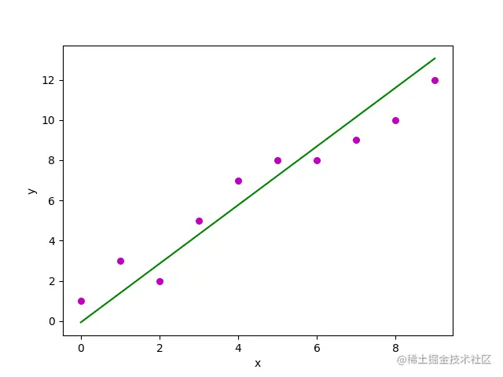

# [线性回归]()
线性回归是一种使用特征属性的线性组合来预测响应的方法。
它的目标是找到一个线性函数，以尽可能准确地描述特征或自变量（x）与响应值（y）之间的关系，使得预测值与真实值之间的误差最小化。

### [数学定义]()

在数学上，线性回归要找的这个线性函数叫回归方程，其定义如下：$h(x^{(i)})=β_{0} + β_{1}x^{(i)} \qquad(1.1)$
其中，$h(x^{(i)})$ 表示第i个样本的预测响应值。$β_{0}$、$β_{1}$是回归系数，分别代表回归线的y轴截距和斜率。这种形式通常见于特征只有单个属性的时候，也就是一元线性回归。
在机器学习中，通常每个样本都有n个特征属性，每个特征$x_{i}$都有一个对应的权值$w_{i}$，此时我们需要的就是多元线性回归：
$$ h(x) = w_{0}*x_{0}+w_{1}*x_{1}+w_{2}*x_{2}+...+w_{n}*x_{n} = w^{T}X  \qquad (1.2)$$
其中，$x_{0}=1$ 没有实义，只是为了方便写成矩阵的形式，$w_{0}$则等价于式 (1.1) 中的$β_{0}$，把$β_{0}$融入矩阵中，不仅为了看起来简洁，也是为了方便计算。

若损失函数采用平方和损失表示，样本$x^{(i)}$的损失函数描述为:$$ l(x^{i}) = \frac{1}{2}(h(x^{(i)})-y^{(i)})^{2} $$
则代价函数表示为：$$J(x) = \frac{1}{2}\sum_{i=1}^{n}(h(x^{(i)})-y^{(i)})^{2}$$
损失函数(Loss Function)度量单样本预测的误差，代价函数(Cost Function)度量全部样本的平均误差。
### [求解方程系数]
我们的目标是要找到一组 $𝑤(𝑤_{0},𝑤_{1},𝑤_{2},...,𝑤_{𝑛})$，使得代价函数J(w)最小，即最小化 $\frac{\partial J(w)}{\partial w}$​。

- 梯度下降法

|算法类别|样本数量|公式|
|-|-|-|
|批量梯度下降(Batch Gradient Descent,BGD)|全部样本|$w_{j} = w_{j} - \alpha*\frac{1}{m}\sum_{i=1}^{n}(h(x^{(i)})-y^{(i)})x^{(i)}$|
|随机梯度下降(Stochastic Gradient Descent,SGD)|随机一个样本|$w_{j} = w_{j} - \alpha*(h(x^{(i)})-y^{(i)})x^{(i)}$|
|小批量随机梯度下降(Mini-Batch Gradient Descent,MBGD)|随机部分样本|$w_{j} = w_{j} - \alpha*\frac{1}{b}\sum_{k=i}^{i+b-1}(h(x^{(k)})-y^{(k)})x_{j}^{(k)}$|

其中，$\alpha$ 称为学习率。根据公式，不难看出，BGD和SGD 其实是MBGD的b取值为m和1时的特殊情况。我们以 SGD 为例，推导一遍参数的更新过程。

$$
   \begin{align}
    \frac{\partial J(w)}{\partial w_{j}} &= \frac{1}{2}*\frac{\partial (h(x^{(i)})-y^{(i)})^{2}}{\partial w_{j}} \\
                                &= 2*\frac{1}{2}*(h(x^{(i)})-y^{(i)})\frac{\partial (h(x^{(i)})-y^{(i)})}{\partial w_{j}} \\
                                &= (h(x^{(i)})-y^{(i)})\frac{\partial (\sum_{i=1}^{n}(w^{(i)}x^{(i)}-y^{(i)}))}{\partial w_{j}} \\
                                &= (h(x^{(i)})-y^{(i)})x_{j}^{(i)}
   \end{align}
$$
$又w_{j}=w_{j}−\alpha*\frac{\partial J(w)}{\partial w_{j}}，所以 w_{j}:=wj−α(h(x^{(i)})-y^{(i)})x_{j}^{(i)}$
- 

------

参考：https://juejin.cn/post/7057447537757650957#heading-7