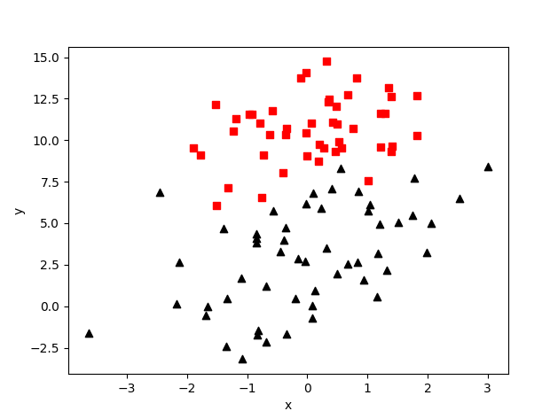

# [LR回归(Logistic Regression)]()
## [Logistic 回归 概述]()
Logistic回归 或者叫逻辑回归 虽然名字有回归，但是它是用来做分类的。其主要思想是: 根据现有数据对分类边界线(Decision Boundary)建立回归公式，以此进行分类。

[何为回归呢?]()
假设现在有一些数据点，我们用一条直线对这些点进行拟合（这条直线称为最佳拟合直线），这个拟合的过程就叫做回归。进而可以得到对这些点的拟合直线方程，

那么我们根据这个回归方程，怎么进行分类呢？
我们需要一种函数：$\color{Orange}{能接受所有的输入，然后返回预测出类别。}$例如，在两个类的情况下，上述函数输出 0 或 1.或许你之前接触过具有这种性质的函数，该函数称为 海维塞得阶跃函数(Heaviside step function)，或者直接称为 单位阶跃函数。然而，海维塞得阶跃函数的问题在于: 该函数在跳跃点上从 0 瞬间跳跃到 1，这个瞬间跳跃过程有时很难处理。

幸好，另一个函数也有类似的性质（可以输出 0 或者 1 的性质），且数学上更易处理，这就是 Sigmoid 函数。 Sigmoid 函数具体的计
海维塞得阶跃函数(Heaviside step function):
$$ 
H(n)= \begin{cases} 0, & \text {n $\lt$ 0;} \\ 1, & \text{n $\geq$ 0;} \end{cases} $$
Sigmoid 函数:
$$
\sigma(z)=\frac{1}{1+e^{-z}}
$$
](../image/lr1.png)
为了实现 Logistic 回归分类器，我们可以在每个特征上都乘以一个回归系数（如下公式所示），然后把所有结果值相加，将这个总和代入 Sigmoid 函数中，进而得到一个范围在 0~1 之间的数值。任何大于 0.5 的数据被分入 1 类，小于 0.5 即被归入 0 类。所以，Logistic 回归也是一种概率估计，比如这里Sigmoid 函数得出的值为0.5，可以理解为给定数据和参数，数据被分入 1 类的概率为0.5。


Sigmoid 函数的输入记为 z ，由下面公式得到:
$$
z = w_{0}x_{0} + w_{1}x_{1} + w_{2}x_{2} + ...+ w_{n}x_{n}
$$

[如何求解回归系数呢?]()
参数估计常用方法：[梯度上升和梯度下降](参数估计—梯度上升和梯度下降.md)、[最小二乘法](参数估计—最小二乘法.md)、[极大似然估计](参数估计—极大似然估计.md)

## [算法实现]()
### 项目案例1: 使用 Logistic 回归在简单数据集上的分类
在一个简单的数据集上，采用梯度上升法找到 Logistic 回归分类器在此数据集上的最佳回归系数
#### 开发流程

```
收集数据: 可以使用任何方法
准备数据: 由于需要进行距离计算，因此要求数据类型为数值型。另外，结构化数据格式则最佳
分析数据: 画出决策边界
训练算法: 使用梯度上升找到最佳参数
测试算法: 使用 Logistic 回归进行分类使用算
```
我们采用存储在 TestSet.txt 文本文件中的数据，存储格式如下: 

```
-0.017612	14.053064	0
-1.395634	4.662541	1
-0.752157	6.538620	0
-1.322371	7.152853	0
0.423363	11.054677	0
```

绘制在图中，如下图所示: 
](../image/LR_11.png)
> 准备数据: 由于需要进行距离计算，因此要求数据类型为数值型。另外，结构化数据格式则最佳

```python
# 解析数据
def loadDataSet(file_name):
```
> 分析数据: 采用任意方法对数据进行分析，此处不需要

> 训练算法: 使用梯度上升找到最佳参数


### 项目案例2: 从疝气病症预测病马的死亡率
#### 项目概述

使用 Logistic 回归来预测患有疝病的马的存活问题。疝病是描述马胃肠痛的术语。然而，这种病不一定源自马的胃肠问题，其他问题也可能引发马疝病。这个数据集中包含了医院检测马疝病的一些指标，有的指标比较主观，有的指标难以测量，例如马的疼痛级别。

#### 开发流程

```
收集数据: 给定数据文件
准备数据: 用 Python 解析文本文件并填充缺失值
分析数据: 可视化并观察数据
训练算法: 使用优化算法，找到最佳的系数
测试算法: 为了量化回归的效果，需要观察错误率。根据错误率决定是否回退到训练阶段，
         通过改变迭代的次数和步长的参数来得到更好的回归系数
使用算法: 实现一个简单的命令行程序来收集马的症状并输出预测结果并非难事，
         这可以作为留给大家的一道习题
```

> 收集数据: 给定数据文件

病马的训练数据已经给出来了，如下形式存储在文本文件中:

```
1.000000	1.000000	39.200000	88.000000	20.000000	0.000000	0.000000	4.000000	1.000000	3.000000	4.000000	2.000000	0.000000	0.000000	0.000000	4.000000	2.000000	50.000000	85.000000	2.000000	2.000000	0.000000
2.000000	1.000000	38.300000	40.000000	24.000000	1.000000	1.000000	3.000000	1.000000	3.000000	3.000000	1.000000	0.000000	0.000000	0.000000	1.000000	1.000000	33.000000	6.700000	0.000000	0.000000	1.000000
```

> 准备数据: 用 Python 解析文本文件并填充缺失值
处理数据中的缺失值

假设有100个样本和20个特征，这些数据都是机器收集回来的。若机器上的某个传感器损坏导致一个特征无效时该怎么办？此时是否要扔掉整个数据？这种情况下，另外19个特征怎么办？
它们是否还可以用？答案是肯定的。因为有时候数据相当昂贵，扔掉和重新获取都是不可取的，所以必须采用一些方法来解决这个问题。

下面给出了一些可选的做法: 
* 使用可用特征的均值来填补缺失值；
* 使用特殊值来填补缺失值，如 -1；
* 忽略有缺失值的样本；
* 使用有相似样本的均值添补缺失值；
* 使用另外的机器学习算法预测缺失值。

现在，我们对下一节要用的数据集进行预处理，使其可以顺利地使用分类算法。在预处理需要做两件事: 
* 所有的缺失值必须用一个实数值来替换，因为我们使用的 NumPy 数据类型不允许包含缺失值。我们这里选择实数 0 来替换所有缺失值，恰好能适用于 Logistic 回归。这样做的直觉在于，我们需要的是一个在更新时不会影响系数的值。回归系数的更新公式如下:

    weights = weights + alpha * error * dataMatrix[dataIndex[randIndex]]

    如果 dataMatrix 的某个特征对应值为 0，那么该特征的系数将不做更新，即:

    weights = weights

    另外，由于 Sigmoid(0) = 0.5 ，即它对结果的预测不具有任何倾向性，因此我们上述做法也不会对误差造成任何影响。基于上述原因，将缺失值用 0 代替既可以保留现有数据，也不需要对优化算法进行修改。此外，该数据集中的特征取值一般不为 0，因此在某种意义上说它也满足 “特殊值” 这个要求。

* 如果在测试数据集中发现了一条数据的类别标签已经缺失，那么我们的简单做法是将该条数据丢弃。这是因为类别标签与特征不同，很难确定采用某个合适的值来替换。采用 Logistic 回归进行分类时这种做法是合理的，而如果采用类似 kNN 的方法，则保留该条数据显得更加合理。

原始的数据集经过预处理后，保存成两个文件: horseColicTest.txt 和 horseColicTraining.txt 。 

> 分析数据: 可视化并观察数据

将数据使用 MatPlotlib 打印出来，观察数据是否是我们想要的格式

> 训练算法: 使用优化算法，找到最佳的系数