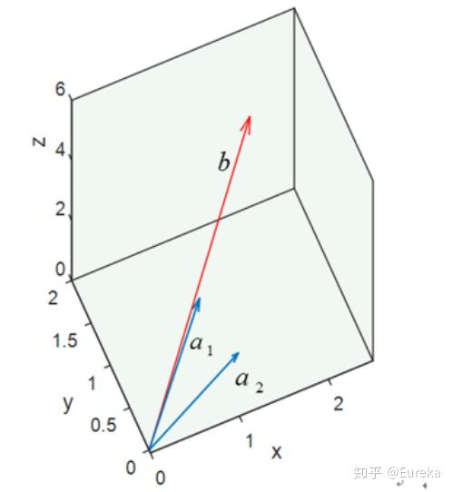

# [定义]()
最小二乘法（OLS）是一种数学优化技术。它通过最小化误差的平方和寻找数据的最佳函数匹配。利用最小二乘法可以简便地求得未知的数据，并使得这些求得的数据与实际数据之间误差的平方和为最小 。
最小二乘法还可用于曲线拟合，其他一些优化问题也可通过最小化能量或最大化熵用最小二乘法来表达。

# [最小二乘法基本思想]()
最小二乘法是由勒让德在19世纪发现的，形式如下式：
$$　　　　
目标函数 = \sum (观测值-理论值)^2 
$$
观测值是多组样本，理论值就是假设拟合函数。目标函数是机器学习中常说的损失函数，目标是得到使目标函数最小化时候的拟合函数的模型。
举一个最简单的线性回归的简单例子，如有m个只有一个特征的样本:$(x_{i},y_{i})$(i=1,2,...,m)样本采用$h_{\theta}(x)$的多项式拟合函数：
$$
h_{\theta}(x) = \theta _{1}x+ \theta _{0} , (\theta _{0},\theta _{1}为参数)
$$

$\color{Orange}{问题转化为——求解对应的拟合函数有两个参数 }$$\theta _{0},\theta _{1}$。
其目标函数为：
$$
\begin{align}
J(\theta _{0},\theta _{1}) & = \sum_{i=1}^{m}(h_{\theta}(x^{(i)})-y^{(i)})^2 & = \sum_{i=1}^{m}(\theta _{1}*x^{(i)}+\theta _{0}-y^{(i)})^2
\end{align}
$$
目的是最小化目标函数
$$
\begin{align}
minJ(\theta _{0},\theta _{1}) = min \sum_{i=1}^{m}(\theta _{1}*x^{(i)} + \theta _{0} - y^{(i)})^2
\end{align}
$$

# [最小二乘法的代数法解法]()
要使 $J(\theta _{0},\theta _{1})$最小，方法就是对$\theta _{0},\theta _{1}$分别求偏导数，令偏导数为0，得到一个关于$\theta _{0},\theta _{1}$的二元方程组。求解这个二元方程组，就可以得到$\theta _{0},\theta _{1}$的值。

$J(\theta _{0},\theta _{1})$对$\theta _{0}$求偏导，得到如下方程：
$$
\begin{align}
\frac{\partial J(\theta _{0},\theta _{1})}{\partial \theta _{0}} = 2*\sum_{i=1}^{m}(\theta _{1}*x^{(i)}+\theta _{0}-y^{(i)}) = 0
\end{align}
$$
$J(\theta _{0},\theta _{1})$对$\theta _{1}$求偏导，得到如下方程：
$$
\begin{align}
\frac{\partial J(\theta _{0},\theta _{1})}{\partial \theta _{1}} = 2*\sum_{i=1}^{m}x^{(i)}(\theta _{1}*x^{(i)}+\theta _{0}-y^{(i)}) = 0
\end{align}
$$
将3和4组成二元一次方程组，求解$\theta _{0},\theta _{1}$
$$
\begin{cases}
 \sum_{i=1}^{m}(\theta _{1}*x^{(i)}+\theta _{0}-y^{(i)}) = 0  \\
 \sum_{i=1}^{m}x^{(i)}(\theta _{1}*x^{(i)}+\theta _{0}-y^{(i)}) = 0
\end{cases}
$$
$$
\begin{align}
\theta _{0} & = \frac{\sum_{i=1}^{m}(x^{(i)})^2\sum_{i=1}^{m}y^{(i)} - \sum_{i=1}^{m}x^{(i)}\sum_{i=1}^{m}x^{(i)}y^{(i)}}{m\sum_{i=1}^{m}(x^{(i)})^2-(\sum_{i=1}^{m}x^{(i)})^2} \\
\theta _{1} & = \frac{m \sum_{i=1}^{m}x^{(i)}y^{(i)} - \sum_{i=1}^{m}x^{(i)} \sum_{i=1}^{m}y^{(i)}}{m \sum_{i=1}^{m}(x^{(i)})^2-(\sum_{i=1}^{m}x^{(i)})^2}
\end{align}
$$

## 推广到多个样本特征的线性拟合
拟合函数表示为$h_{\theta}(x_{1},x_{2},x_{3},...,x_{n}) = \theta _{0} + \theta _{1}x_{1} + ...+\theta _{n}x_{n}$,其中$\theta_{i}$(i=1,2,..,n)为模型参数，$x_{i}$(i=1,2,..,n)为每个样本的特征值，为了简化表示，增加一个特征$x_{0}$ =1，这样拟合函数表示为：
$$
h_{\theta}(x_{1},x_{2},x_{3},...,x_{n}) = \sum_{i=1}^{n}\theta _{i}x_{i}
$$
目标函数表示为：
$$
\begin{align}
J(\theta _{0},\theta _{1},...,\theta _{n}) & = \sum_{j=1}^{m}(h_{\theta}(x_{1}^{(j)},x_{2}^{(j)},x_{3}^{(j)},...,x_{n}) - y^{(j)})^2 \\
 & = \sum_{j=1}^{m}(\sum_{i=1}^{n}\theta _{i}x_{i}^{(j)}- y^{(j)})^2
 \end{align}
$$

利用目标函数分别对$\theta_{i}$(i=1,2,..,n)求导，并令导数为0
可得：
$$\sum_{j=1}^{m}(\sum_{i=1}^{n}\theta _{i}x_{i}^{(j)}- y^{(j)})x_{i}^{(j)},(i=1,2,...,n)$$
得到一个N+1元一次方程组，这个方程组有N+1个方程，求解这个方程，就可以得到所有的N+1个未知的θ
 
# [最小二乘法的几何解释]()
最小二乘法的几何意义是高维空间中的一个向量在低维子空间的投影
考虑这样一个简单的问题，求解二元一次方程组：
$$
\begin{bmatrix}
1\\
-1
\end{bmatrix}
*x_{1} +
\begin{bmatrix}
1\\
1
\end{bmatrix}
*x_{2} = b \Leftrightarrow a_{1}*x_{1} + a_{2}*x_{2} = b
$$
表示$x_{1}$倍的向量$a_{1}$加上$x_{2}$的$a_{2}$倍的向量等于向量b。或者说，b是向量$a_{1}$与$a_{2}$的线性组合。
](../image/min2.png)
可以看到，1倍的$a_{1}$加上2倍的$x_{2}$既是b，而1和2正是我们的解。而最小二乘所面临的问题远不止两个点，拿三个点来说吧。（0,2）,（1,2）,（2,3）
](../image/min1.png)
假设我们要找到一条直线 y=kx+b穿过这三个点（虽然不可能），为表述方便，用$x_{1}$代替k,$x_{2}$代替b:
$$
\begin{cases}
  1 * k + b = 2 \\
  0 * k + b = 2 \\
  2 * k + b = 3 
\end{cases}
\Leftrightarrow
\begin{cases}
  1 * x_{1} + x_{2} = 2 \\
  0 * x_{1} + x_{2} = 2 \\
  2 * x_{1} + x_{2} = 3 
\end{cases}
\Leftrightarrow
\begin{bmatrix}
1 & 1 \\
0 & 1 \\
2 & 1 
\end{bmatrix}
\begin{bmatrix}
 x_{1} \\
 x_{2} 
\end{bmatrix} =
\begin{bmatrix}
2 \\
2 \\
3
\end{bmatrix}
\Leftrightarrow 
A * x = b
$$
进一步的：
$$
\begin{bmatrix}
1\\
0\\
2
\end{bmatrix} *
x_{1} +
\begin{bmatrix}
1\\
1\\
1
\end{bmatrix} * x_{2} 
\Leftrightarrow
a_{1}*x_{1} + a_{2} * x_{2} = b
$$
向量b是向量$a_{1}$与$a_{2}$的线性组合。用图形表示：
](../image/min0.png)
作图之后，我们惊讶的发现，无论我们怎样更改$a_{1}$和$a_{2}$的系数都不可能得到b，因为$a_{1}$和$a_{2}$的线性组合成的向量只能落在它们组成的子空间S里面，也就是说，向量不在平面S上，虽然我们找不到这样的向量，但在S上找一个比较接近的可以吧。很自然的想法就是将向量b投影在平面S上，投影在S上的向量P就是b的近似向量，并且方程$A\hat x = P$是有解的。
](../image/min4.png)
这个误差最小的时候就是e正交与平面S,也正交与S中的向量$a_{1}$,$a_{2}$(矩阵A的列向量)，即点乘为0，$a_{1}^{T}e = 0, a_{2}^{T}e=0$ 矩阵表示：
$$
\begin{align}
A^{T}e & = 0 \\
A^{T}(b-A \hat x) &  = 0 \\
A^{T}A \hat x  &  = A^{T}b
\end{align}
$$
所以，我们可以得出，它的几何意义就是高维空间中的一个向量在低维子空间上的投影。

# [最小二乘法的矩阵法解法]()
最小二乘法的代数法解法就是对$\theta_{i}$求偏导数，令偏导数为0，再解方程组，得到$\theta_{i}$。矩阵法比代数法要简洁，通过矩阵运算求其线性方程组的解。
- 假设函数$h_{\theta}(x_{1},x_{2},x_{3},...,x_{n}) = \theta _{0} + \theta _{1}x_{1} + ...+\theta _{n}x_{n}$的矩阵表示方式：
$$h_{\theta}(x) = X*\theta$$
其中：X为(m x n)维矩阵(m表示样本数量，n表示样本特征个数)，$\theta$为(n x 1)维向量，因此$h_{\theta}(x)= X*\theta$表示(m x 1)的向量。

- 损失函数定义为：
$$
\begin{align}
J(\theta) & = \frac{1}{2}(X * \theta - Y)^2 \\
 & = \frac{1}{2}(X * \theta - Y)^{T}(X * \theta - Y)
\end{align}
$$
其中，Y为样本的输出向量，维度为（m x 1）, 1/2在这里是为了求导后计算方便。
- 根据最小二乘法的原理，我们要损失函数$J(\theta)$对$\theta$向量求导（涉及到矩阵求导），然后取导数=0。
$$
\frac{\partial J(\theta)}{\partial \theta} = X^{T}(X_{\theta}-Y) = 0
$$
对上述求导等式整理后可得：
$$
X^{T}X_{\theta} = X^{T}y
$$
两边同时左乘$(X^{T}X)^{-1}$可得：
$$
\color{Black}{\mathbf{\theta = (X^{T}X)^{-1} X^{T}y}}
$$
这样求出了$\theta$向量表达式的公式，免去了代数法一个个去求导的麻烦。
# [最小二乘法的局限性和适用场景]()
从上面可以看出，最小二乘法适用简洁高效，比梯度下降似乎方便很多。
　　最小二乘法的局限性：
- $\mathbf{最小二乘法需要计算(X^{T}X)的逆矩阵，有可能它的逆矩阵不存在，这样就没有办法直接用最小二乘法了，此时梯度下降法仍然可以使用}$。当然，可以通过对样本数据进行整理，去掉冗余特征。让$(X^{T}X)$的行列式不为0，然后继续使用最小二乘法。
- 当样本特征n非常的大的时候，计算$(X^{T}X)$的逆矩阵是一个非常耗时的工作（n x n的矩阵求逆），甚至不可行。此时以梯度下降为代表的迭代法仍然可以使用。那这个n到底多大就不适合最小二乘法呢？如果你没有很多的分布式大数据计算资源，建议超过10000个特征就用迭代法吧。或者通过主成分分析降低特征的维度后再用最小二乘法。
- $\mathbf{如果拟合函数不是线性的，这时无法使用最小二乘法}$，需要通过一些技巧转化为线性才能使用，此时梯度下降仍然可以用。
- 当样本量m很少，小于特征数n的时候，这时拟合方程是欠定的，常用的优化方法都无法去拟合数据。当m = n的时候，用方程组求解就可以了。当m > n时，拟合方程是超定的，也就是常用最小二乘法的场景了

---
# [参考]()
https://www.cnblogs.com/BlairGrowing/p/14847772.html