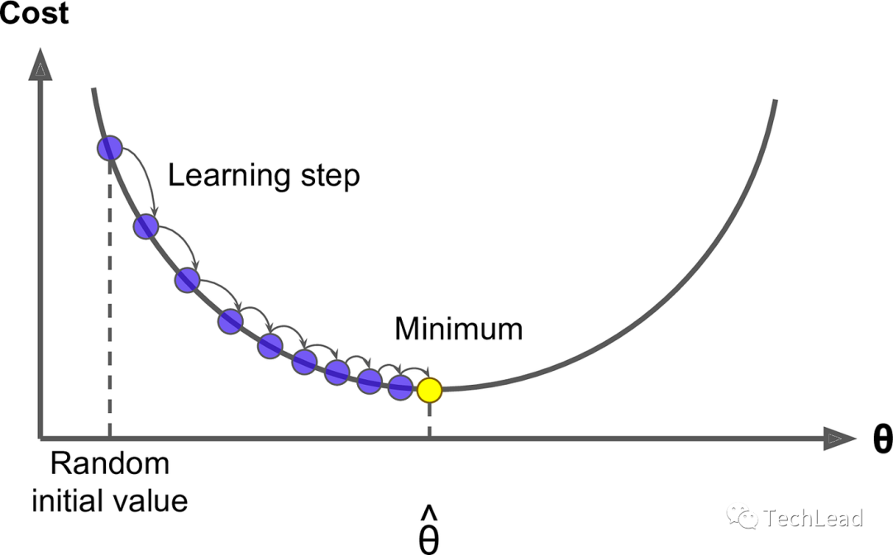
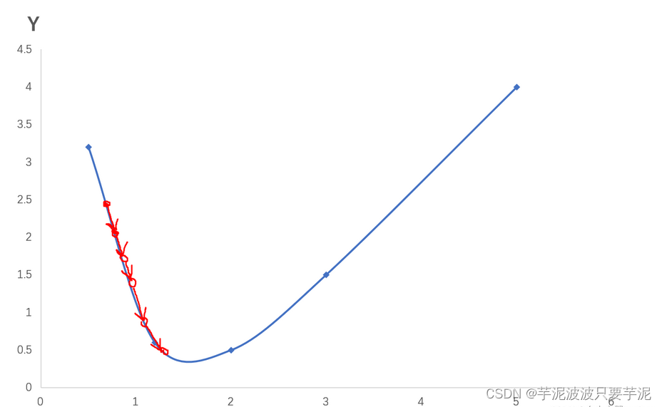
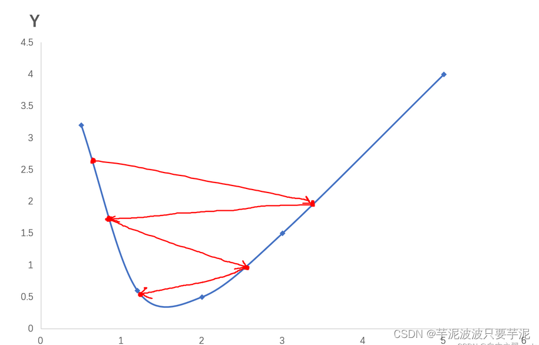
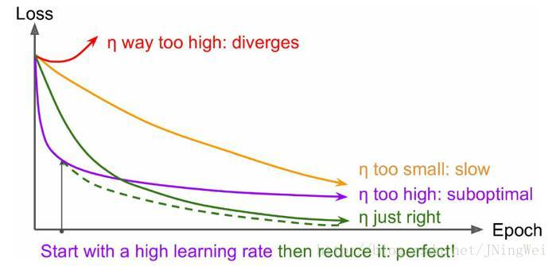

# [学习率]()
](../image/lrate0.png)

## [引言]()
学习率（Learning Rate）是机器学习和深度学习中一个至关重要的概念，它直接影响模型训练的效率和最终性能。简而言之，学习率控制着模型参数在训练过程中的更新幅度。

在传统机器学习算法中(如支持向量机SVM、随机森林)，参数优化通常是通过解析方法或者贪心算法来完成的，学习率概念涉及较少; 学习率在涉及优化问题(如：梯度下降及其变体算法、神经网络等方法)中一个核心的调节因子。

## [学习率对模型训练影响]()
从数学的角度来看,学习率是梯度下降算法中的一个标量,用于权衡目标函数(或损失函数)沿负梯度方向的下降步长。公式表示为:
$\theta_{new} = \theta_{old} - α*\nabla J(\theta_{old})$
其中,0是模型参数,α是学习率,$\nabla J(\theta_{old})$是目标函数J在$\theta_{old}$处的梯度。这里,学习率α决定了模型参数更新的幅度—$\color{Orange}{较小的α可能导致模型收敛缓慢,而较大的α可能会导致模型在最优解附近震荡或者发散。}$
- 学习率太小：导致梯度下降缓慢，训练时间长
](../image/lrate1.png)
- 学习率太大，导致振荡，无法收敛
](../image/lrate2.png)

理想情况下曲线应该是滑梯式下降 [$\color{Green}{绿线}$]:
](../image/lrate3.png)
曲线初始时上扬 [$\color{Red}{红线}$]： 
Solution：初始学习率过大导致振荡，应减小学习率，并从头开始训练 。
曲线初始时强势下降没多久归于水平 [$\color{Purple}{紫线}$]： 
Solution：后期学习率过大导致无法拟合，应减小学习率，并重新训练 后几轮 。
曲线全程缓慢 [$\color{Orange}{黄线}$]： 
Solution：初始学习率过小导致收敛慢，应增大学习率，并从头开始训练 。

学习率的选择对于模型性能有着显著影响。在实践中，不同类型的问题和数据集可能需要不同的学习率或者学习率调整策略。$\color{Orange}{因此，了解如何合适地设置和调整学习率，是每一个机器学习从业者和研究者都需要掌握的基础知识。}$这个领域的研究已经从简单的固定学习率扩展到了更为复杂和高级的自适应学习率算法，如 AdaGrad、RMSprop 和 Adam 等。这些算法试图在训练过程中动态地调整学习率，以适应模型和数据的特性，从而达到更好的优化效果。

## [学习率调整策略]()
合适的调整策略不仅能够加速模型的收敛速度，还能提高模型的泛化性能。
以下是几种常用的学习率调整策略：
### 常量学习率
最简单的学习率调整策略就是使用一个固定的学习率。这是最早期梯度下降算法中常用的方法。虽然实现简单，但常量学习率往往不能适应训练动态，可能导致模型过早地陷入局部最优或者在全局最优点附近震荡。
### 时间衰减策略
$$\alpha_ {t} = \alpha_ {0}*(1+\gamma * t)^{-p}$$
其中,$\alpha_ {t}$是第t轮迭代的学习率,$\alpha_ {0}$是初始学习率,$\gamma$是衰减率,p是一个正实数,用于控制衰减的速度。

### 自适应学习率
自适应学习率算法试图根据模型的训练状态动态调整学习率。以下是一些广泛应用的自适应学习率算法：
  * AdaGrad
(Adaptive Gradient Algorithm)是一种自适应学习率调整算法,它根据过去的梯
度来调整每个参数的学习率。
$$
\begin{align}
    g_{t} & = \nabla J(\theta_{t}) \\
    r_{t} & = r_{t-1} + g_{t} \odot g_{t}  \\
    \theta_{t+1} & =\theta_{t}- \frac{\alpha}{\sqrt{r_{t}+\varepsilon}} \odot g_{t}
\end{align}
$$
其中,$g_{t}$是第t轮迭代的梯度，$r_{t}$是梯度的累积平方和，$\varepsilon$是一个很小的数以防止除以零

  * RMSprop
RMSprop (Root Mean Square Propagation)是对AdaGrad算去的一种改进,它使用了一个
移动平均来代替累积平方和,以解决AdaGrad算法学习率过快衰减的问题。
$$
\begin{align}
r_{t} & =β×r_{t-1} + (1-β) * g_{t} \odot g_{t} \\
\theta_{t+1} & = \theta_{t}-\frac{\alpha}{\sqrt{r_{t}+\varepsilon}} \odot g_{t}
\end{align}
$$
其中,β是一个介于0和1之间的常数,用于控制移动平均的衰减率 

  * Adam
Adam(Adaptive Moment Estimation)结合了Momentum和RMSprop的优点,同时使用一阶矩(均值)和二阶矩(未中心化的方差)来调整学习率。
$$
\begin{align}
m_{t} & = β_{1}×m_{t}-1+(1-β_{1})*g_{t} \\
v_{t} & = β_{2} * v_{t-1}+(1-β_{2}) * g_{t} \odot g_{t} \\
\theta_{t+1} & = \theta_{t}-\frac{\alpha}{\sqrt{r_{t}+\varepsilon}} \odot m_{t}
\end{align}
$$
其中,$m_{t}$和$v_{t}$分别是一阶矩的估计值,β1和β2是估计这两个矩的指数衰减因子。

综上，学习率调整策略不仅影响模型训练的速度，还决定了模型的收敛性和泛化能力。选择合适的学习率调整策略是优化算法成功应用的关键之一。
## [学习率的最佳实践]()
在深度学习中，选择合适的学习率和调整策略对模型性能有着巨大的影响
### 学习率范围测试
定义： 学习率范围测试是一种经验性方法，用于找出模型训练中较优的学习率范围。
例子： 你可以从一个非常小的学习率（如0.0001）开始，每个mini-batch或epoch后逐渐增加，观察模型的损失函数如何变化。当损失函数开始不再下降或开始上升时，就可以找出一个合适的学习率范围。

### 循环学习率（Cyclical Learning Rates）
定义： 循环学习率是一种策略，其中学习率会在一个预定义的范围内周期性地变化。
例子： 你可以设置学习率在0.001和0.1之间循环，周期为10个epochs。这种方法有时能更快地收敛，尤其是当你不确定具体哪个学习率值是最佳选择时。

### 学习率热重启（Learning Rate Warm Restart）
定义： 在每次达到预设的训练周期后，将学习率重置为较高的值，以重新“激活”模型的训练。
例子： 假设你设置了一个周期为20个epochs的学习率衰减策略，每次衰减到较低的值后，你可以在第21个epoch将学习率重置为一个较高的值（如初始值的0.8倍）。

### 梯度裁剪与学习率
定义： 梯度裁剪是在优化过程中限制梯度的大小，以防止因学习率过大而导致的梯度爆炸。
例子： 在某些NLP模型或RNN模型中，由于梯度可能会变得非常大，因此采用梯度裁剪和较小的学习率通常更为稳妥。

### 使用预训练模型和微调学习率
定义： 当使用预训练模型（如VGG、ResNet等）时，微调学习率是非常关键的。通常，预训练模型的顶层（或自定义层）会使用更高的学习率，而底层会使用较低的学习率。
例子： 如果你在一个图像分类任务中使用预训练的ResNet模型，可以为新添加的全连接层设置较高的学习率（如0.001），而对于预训练模型的其他层则可以设置较低的学习率（如0.0001）。

总体而言，学习率的选择和调整需要根据具体的应用场景和模型需求来进行。这些最佳实践提供了一些通用的指导方针，但最重要的还是通过不断的实验和调整来找到最适合你模型和数据的策略。
## [总结]()
本文从学习率的基础知识出发，深入探讨了各种调整策略，并通过代码实战和最佳实践为读者提供了全面的指导。

- 自适应优化与全局最优：虽然像Adam这样的自适应学习率方法在很多情况下表现出色，但它们不一定总是能找到全局最优解。在某些需要精确优化的应用中（如生成模型），更加保守的手动调整学习率或者更复杂的调度策略可能会更有效。
- 复杂性与鲁棒性的权衡：更复杂的学习率调整策略（如循环学习率、学习率热重启）虽然能带来更快的收敛，但同时也增加了模型过拟合的风险。因此，在使用这些高级策略时，配合其他正则化技术（如Dropout、权重衰减）是非常重要的。
- 数据依赖性：学习率的最佳设定和调整策略高度依赖于具体的数据分布。例如，在处理不平衡数据集时，较低的学习率可能更有助于模型学习到少数类的特征。
模型复杂性与学习率：对于更复杂的模型（如深层网络或者Transformer结构），通常需要更精细的学习率调控。这不仅因为复杂模型有更多的参数，还因为它们的优化面通常更为复杂和崎岖。
---
参考资料链接：
https://cloud.tencent.com/developer/article/2351463
https://blog.csdn.net/weixin_51401355/article/details/130169822
https://blog.csdn.net/qq_33485434/article/details/80452941