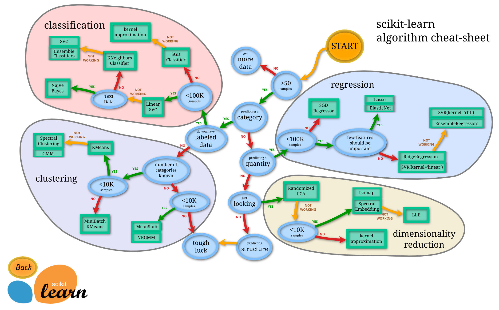

机器学习既是艺术又是科学。当你研究机器学习算法时，你会发现没有一种解决方案或一种方法可以适用于所有情况。有多种因素会影响你选择机器学习算法的决定。

$\color{Orange}{有些问题非常具体，需要独特的方法。}$例如，如果你看一下推荐系统，它是一种非常常见的机器学习算法，可以解决一种非常具体的问题。$\color{Orange}{而其他一些问题则非常开放，需要反复试验的方法。}$监督学习、分类和回归等非常开放。它们可以用于异常检测，也可以用于构建更通用的预测模型。
此外，$\color{Orange}{我们在选择机器学习算法时做出的一些决定与算法的优化或技术方面关系不大，而与业务决策关系更大。}$

下面我们来看看一些可以帮助你缩小机器学习算法搜索范围的因素。

# [数据科学流程]()

在开始研究不同的 ML 算法之前，您需要清楚地了解您的数据、问题和约束。

我们拥有的数据类型和种类在决定使用哪种算法时起着关键作用。有些算法可以处理较小的样本集，而其他算法则需要大量样本。某些算法适用于某些类型的数据。例如，朴素贝叶斯算法适用于分类输入，但对缺失数据一点也不敏感。

$\color{Orange}{因此，您必须：“了解你的数据”。}$ 

## [了解你的数据]()

- 查看摘要统计数据和可视化效果
    * 百分位数可以帮助识别大多数数据的范围
    * 平均值和中位数可以描述集中趋势
    * 相关性可以表明紧密的关系

- 数据可视化
    * 箱线图:可以识别异常值
    * 密度图和直方图:显示数据的分布
    * 散点图:可以描述双变量关系

- 清理数据
    * 处理缺失值。缺失数据对某些模型的影响比其他模型更大。即使是处理缺失数据的模型，它们也会对此很敏感（某些变量的缺失数据可能导致预测不佳）
    * 选择如何处理异常值
        - 异常值在多维数据中非常常见。
        - 有些模型对异常值的敏感度低于其他模型。通常，树模型对异常值的存在不太敏感。然而，回归模型或任何试图使用方程的模型肯定会受到异常值的影响。
        - 异常值可能是数据收集不当的结果，也可能是合法的极端值。
    * 数据是否需要汇总

- 增强你的数据
    - 特征工程是从原始数据到可用于建模的数据的过程。它可以用于多种目的：
        - 使模型更易于解释（例如分箱）
        - 捕捉更复杂的关系（例如 NN）
        - 减少数据冗余和维数（例如PCA）
        - 重新调整变量（例如标准化或规范化）
    - 不同的模型可能有不同的特征工程要求。有些模型已经内置了特征工程。

- 对问题进行分类
下一步是对问题进行分类。这是一个两步过程。
    * 按输入分类：
        - 如果您有标记数据，那么这就是一个监督学习问题。
        - 如果您有未标记的数据并想要找到结构，那么这是一个无监督学习问题。
        - 如果你想通过与环境交互来优化目标函数，这就是强化学习问题。
    * 按产量分类。
        - 如果您的模型的输出是一个数字，那么它就是一个回归问题。
        - 如果模型的输出是一个类，那么它就是一个分类问题。
        - 如果模型的输出是一组输入组，那么它就是一个聚类问题。
        - 你想检测异常吗？这就是异常检测

## [了解你的限制]()
- 您的数据存储容量是多少？根据系统的存储容量，您可能无法存储 GB 的分类/回归模型或 GB 的数据进行聚类。例如，对于嵌入式系统就是这种情况。
- 预测必须快速吗？在实时应用中，尽可能快地进行预测显然非常重要。例如，在自动驾驶中，尽可能快地对路标进行分类以避免事故非常重要。
- 学习必须快速吗？在某些情况下，快速训练模型是必要的：有时，你需要使用不同的数据集快速更新你的模型。

## [查找可用的算法]()
现在您已经清楚了解了自己的立场，您可以使用可用的工具确定适用且实用的算法。影响模型选择的一些因素包括：
- 该模型是否符合业务目标
- 模型需要多少预处理
- 模型的准确度
- 模型的可解释性如何
- 模型的速度有多快：建立模型需要多长时间，模型需要多长时间进行预测。
- 模型的可扩展性如何

影响算法选择的一个重要标准是模型复杂度。一般来说，一个模型比较复杂的是：
- 它依赖于更多的特征来学习和预测（例如，使用两个特征与十个特征来预测目标）
- 它依赖于更复杂的特征工程（例如使用多项式项、交互或主成分）
- 它具有更多的计算开销（例如，单个决策树与 100 棵树的随机森林）。

除此之外，相同的机器学习算法可以根据参数数量或某些超参数的选择变得更加复杂。例如，

- 回归模型可以有更多特征，或者多项式项和交互项。
- 决策树的深度可以更多或更少。
使相同的算法更加复杂会增加过度拟合的可能性。
（克服生产级机器学习工作流程的障碍）

## [常用的机器学习算法]()

### [线性回归]()
这些可能是机器学习中最简单的算法。例如，当您想要计算一些连续值时，可以使用回归算法，而分类算法的输出是分类的。因此，每当您被要求预测当前正在运行的进程的未来值时，您都可以使用回归算法。然而，如果特征冗余，即存在多重共线性，线性回归是不稳定的
可以使用线性回归的一些示例包括：
- 从一个地方到另一个地方的时间
- 预测下个月特定产品的销量
- 血液酒精含量对协调性的影响
- 预测每月礼品卡销售额并改善年度收入预测

### [逻辑回归]()
逻辑回归执行二元分类，因此标签输出是二元的。它采用特征的线性组合并对其应用非线性函数（Sigmoid），因此它是神经网络的一个非常小的实例。

逻辑回归提供了很多方法来规范化你的模型，你不必像在朴素贝叶斯中那样担心特征之间的相关性。你还可以获得很好的概率解释，并且可以轻松更新模型以接收新数据，这与决策树或 SVM 不同。如果你想要一个概率框架，或者你希望将来能收到更多训练数据，并希望能够快速将其纳入你的模型，那么就使用逻辑回归吧。

逻辑回归还可以帮助您了解预测背后的影响因素，而不仅仅是一种黑箱方法。
逻辑回归可用于以下情况：
- 预测客户流失
- 信用评分和欺诈检测
- 衡量营销活动的有效性

### [决策树]()
单棵树很少使用，但与许多其他树组合在一起，它们可以构建非常有效的算法，例如随机森林或梯度树提升。

决策树可以轻松处理特征交互，而且它们是非参数的，因此您不必担心异常值或数据是否线性可分。一个缺点是它们不支持在线学习，因此当出现新示例时，您必须重建树。另一个缺点是它们很容易过度拟合，但这就是随机森林（或增强树）等集成方法的用武之地。决策树也会占用大量内存（您拥有的特征越多，您的决策树就可能越深越大）树木是帮助您在几种行动方案之间做出选择的绝佳工具。
- 投资决策
- 客户流失
- 银行贷款违约者
- 构建还是购买决策
- 销售线索资格
### [K 均值]()
有时你不知道任何标签，你的目标是根据对象的特征分配标签。这称为聚类任务。例如，当有一大群用户并且你想根据一些共同属性将他们划分为特定组时，可以使用聚类算法。

如果您的问题陈述中包含如何组织、如何对某些内容进行分组或如何集中于特定的群体等问题，那么您应该使用聚类。

最大的缺点是 K-Means 需要提前知道你的数据中会有多少个聚类，因此这可能需要大量试验来“猜测”要定义的最佳 K 个聚类数。

### [主成分分析 (PCA)]()
主成分分析可以降低维度。有时，您拥有广泛的特征，这些特征彼此之间可能高度相关，模型很容易在大量数据上过度拟合。然后，您可以应用 PCA。

PCA 成功的关键之一是，除了低维样本表示之外，它还提供了变量的同步低维表示。同步的样本和变量表示提供了一种直观地查找一组样本特征变量的方法。

### [支持向量机]()
支持向量机 (SVM) 是一种监督机器学习技术，广泛应用于模式识别和分类问题——当您的数据恰好有两个类别时。

高精度、良好的理论保证，避免过拟合，并且使用合适的核，即使数据在基础特征空间中不是线性可分的，它们也能很好地工作。在文本分类问题中尤其受欢迎，因为高维空间是常态。然而，SVM 占用大量内存，难以解释，也难以调整。

SVM 可用于实际应用，例如：
- 检测患有糖尿病等常见疾病的人
- 手写字符识别
- 文本分类——按主题分类的新闻文章
- 股票市场价格预测

### [朴素贝叶斯]()
这是一种基于贝叶斯定理的分类技术，非常容易构建，尤其适用于非常大的数据集。朴素贝叶斯不仅简单，而且甚至比非常复杂的分类方法表现更好。当 CPU 和内存资源成为限制因素时，朴素贝叶斯也是一个不错的选择。

朴素贝叶斯非常简单，你只需要进行一些计数。如果 NB 条件独立性假设确实成立，朴素贝叶斯分类器的收敛速度将比逻辑回归等判别模型更快，因此你需要的训练数据更少。即使 NB 假设不成立，NB 分类器在实践中仍然经常表现出色。如果你想要快速、简单且性能良好的分类器，这是一个不错的选择。它的主要缺点是它无法学习特征之间的相互作用。

朴素贝叶斯可用于实际应用，例如：
- 情绪分析和文本分类
- Netflix、亚马逊等推荐系统
- 将电子邮件标记为垃圾邮件或非垃圾邮件
- 人脸识别

### [随机森林]()
随机森林是决策树的集合。它可以解决大型数据集的回归和分类问题。它还有助于从数千个输入变量中识别最重要的变量。随机森林可高度扩展到任意数量的维度，并且通常具有相当不错的性能。最后，还有遗传算法，它可以很好地扩展到任何维度和任何数据，并且对数据本身的了解很少，其中最小和最简单的实现是微生物遗传算法。然而，使用随机森林，学习可能很慢（取决于参数化），并且无法迭代改进生成的模型

随机森林可用于实际应用，例如：
- 预测患者的高风险
- 预测制造过程中的零件故障
- 预测贷款违约者

### [神经网络]()
神经网络吸收了神经元之间连接的权重。权重是平衡的，在学习数据点之后学习数据点。当所有权重都训练好后，如果出现新输入数据点回归的情况，神经网络可以用来预测类别或数量。利用神经网络，可以训练非常复杂的模型，并将其用作一种黑匣子，而不必在训练模型之前执行复杂而繁琐的特征工程。结合“深度方法”，可以选择更复杂的模型来实现新的可能性。例如，最近利用深度神经网络大大增强了物体识别能力。深度学习应用于特征提取等无监督学习任务，还可以从原始图像或语音中提取特征，而不需要太多的人为干预。

另一方面，神经网络很难阐明，参数化也极其复杂。它们也非常耗费资源和内存。

## [Scikit-learn 备忘单]()
Scikit 学习提供了一个非常深入且解释得很好的流程图来帮助您选择正确的算法，我发现这非常方便。

中文版
](../image/alg-cn.png)
英文版
](../image/alg-en.png)

# [结论]()

一般来说，您可以使用上述要点来筛选一些算法，但一开始很难知道哪种算法效果最好。通常最好以迭代方式工作。在您确定为潜在好方法的 ML 算法中，将您的数据放入其中，并行或串行运行它们，最后评估算法的性能以选择最佳算法。

最后，开发解决实际问题的正确解决方案绝不仅仅是一个应用数学问题。它需要了解业务需求、规则和法规以及利益相关者的顾虑，以及丰富的专业知识。在解决机器问题时，能够结合和平衡这些至关重要；能够做到这一点的人可以创造最大的价值。