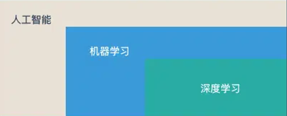
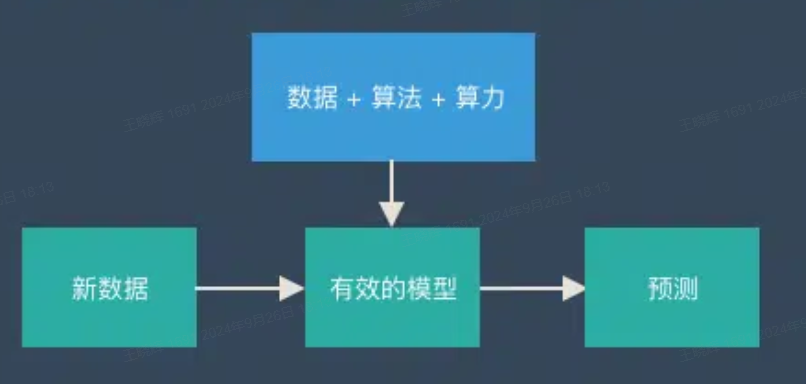
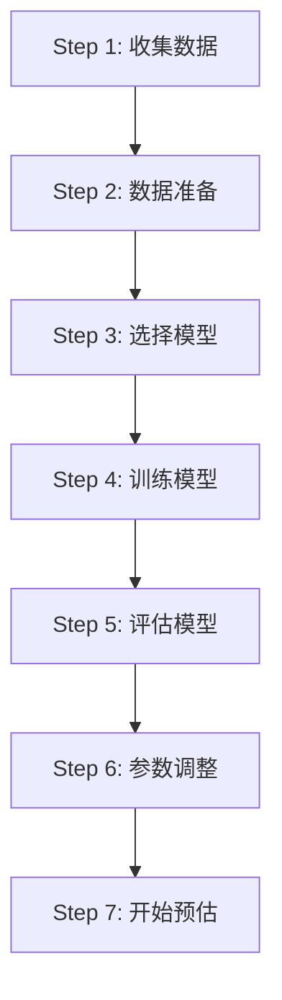
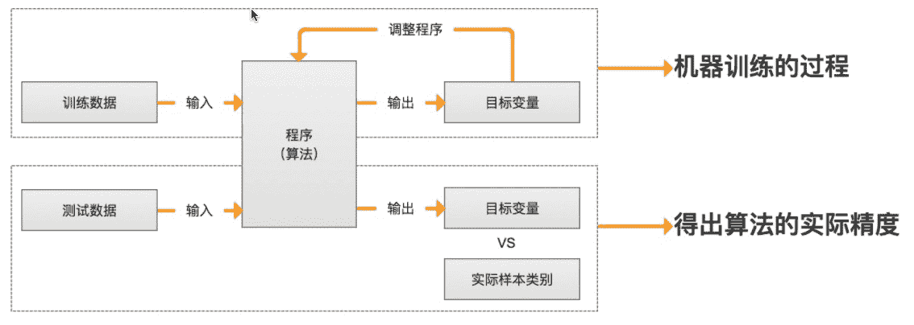
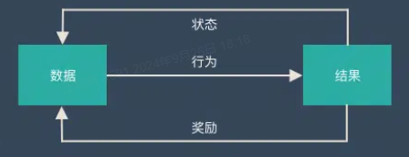

# [机器学习概述]()

## [一、机器学习基本概念]()
机器学习是人工智能的一个分支
大家熟悉的AlphaGo(深度学习)又是机器学习下的一个分支
](../image/ml1.png)

[机器学习定义]()
机器学习研究和构建的是一种特殊算法(而非某一个特定的算法),能够让计算机自己在数据中学习从而进行预测。

[机器学习的基本思路]()
- 把现实生活中的问题抽象成数学模型
- 利用数学方法求解数学问题,从而解决现实生活中的问题
- 评估数学模型,是否解决了现实生活中的问题,解决的如何

](../image/ml2.png)

## [二、机器学习原理]()
机器学习的目的是训练出一个有效的模型,然后通过这个模型做出预测。
天气预报就是典型的案例:
机器通过大量数据学会了是否下雨的逻辑。
这套逻辑同样适用未来(新的数据),于是就有了天气预报。
](../image/ml3.png)

## [三、机器学习流程]()
机器学习的实践过程一共分为7个步骤,完成这7个步骤就可以人得到一个可靠的预测模型了。

[训练过程]()
](../image/ml-train.jpg)
## [四、机器学习分类]()
### [监督学习(Supervised learning)]()
监督学习，采用包含输入和输出的训练数据训练模型，用来预测新样本的输出。多用于回归、分类等任务
](../image/ml3.png)
### [无监督学习(Unsupervised learning)]()
无监督学习，采用的训练数据是不包含输出标签的，算法在输出未知的情况下学习，然后利用学习好的算法预测新样本的输出。多用于聚类、降维等任务
](../image/ml4.png)
### [半监督学习(Semi-supervised learning)]()
半监督学习将大量的无类标签的样例加入到有限的有类标签的样本中一起训练来进行学习，期望能对学习性能起到改进的作用。
### [强化学习]()
强化学习系统（智能体，agent）可以对环境进行观察、选择和执行动作，获得奖励，然后自己学习哪个是最佳策略，以得到长久的最大奖励。
](../image/ml5.png)

## [五、机器学习主流算法]()

* 监督学习算法
  - 线性回归
  - 决策树
  - 逻辑回归
  - 朴素贝叶斯
  -  支持向量机
  - 线性判别分析
  - K 邻近算法
  - 随机森林
  - 学习向量量化
  - Adaboost

* 无监督学习算法
  - 高斯混合模型
  - K-means聚类
  - 限制波尔兹曼机
  - 最大期望算法

* 强化学习算法
  - Q-Learning
  - Policy Optimization

---------
https://easyai.teach