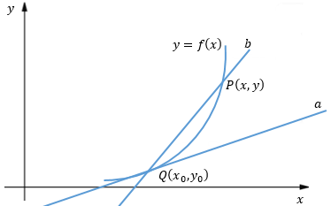

# [一、梯度概念(Gradient)]()
 ## [1.1 导数、偏导数]()
  
  ### 导数
    导数是高数中的重要概念，被应用于多种学科,用于解决瞬时变化率的。        
  - 从物理意义上讲，导数就是求解变化率的问题  

    我们熟知的速度公式：v = s/t，这求解的是平均速度，实际上往往需要知道瞬时速度:
    $$
     v = \cfrac{s-s_0}{t-t_0}
    $$
    当t趋近于t0，即t-t0趋近于0时，得到的就是顺时速度。设Δt=t-t0，s是t的函数s=f(t)，瞬时速度用数学表示就是：

    $$
         v = \lim_{\nabla t \to 0}\cfrac{f(t)-f(t_{0})}{\nabla t}
    $$

  - 从几何意义上讲，导数就是求函数在某一点上的切线的斜率。
](../image/dot2.png)
        直线a与曲线相切于点Q，直线b与曲线相割于点Q和点P。b的斜率是k=(y-y0)/(x-x0)，当b以Q为轴心沿着曲线旋转时，铉长|PQ|趋近于0，即x→x0时，极限存在
$$
 k = \lim_{x \to x_{0}}\cfrac{y-y_{0}}{x-x_{0}}
$$
  - 导数定义：
        设函数y=f(x)在点x0的某个邻域内有定义，当自变量x在x0处取得增量Δx，且x0+Δx仍在该邻域内时，y取得增量Δy；如果Δy与Δx之比在Δx→0时存在极限，则称函数y=f(x)在点x0处可导，并称这个极限为函数y=f(x)在点x0处的导数，记作f’(x0) ：
        $$
         f'(x) = \lim_{\nabla x \to 0}\cfrac{\nabla y}{\nabla x} = \lim_{\nabla x \to 0} \cfrac{f(x_{0} + \nabla x) - f(x_0)}{\nabla x}
        $$
        也记作：
         $$
          f' = |_{x=x_{0}}或者 \cfrac{dy}{dx}
         $$
  - 常用函数导数运算
](../image/dot3.png)

  ### 偏导数

## [1.2 导数与方向导数]()

## [1.3 导数与梯度]()

# [二、机器学习为什么要用梯度上升、梯度下降算法]()

# [三、梯度下降与梯度上升区别]()

# [四、梯度下降常用算法]()

# [五、梯度上升常用算法]()

---
参考书：
《高等数学》、《简明微积分》

参考链接：
梯度
https://zh.wikipedia.org/zh-cn/%E5%81%8F%E5%AF%BC%E6%95%B0
方向导数和梯度
http://blog.csdn.net/wolenski/article/details/8030654

https://blog.csdn.net/walilk/article/details/50978864